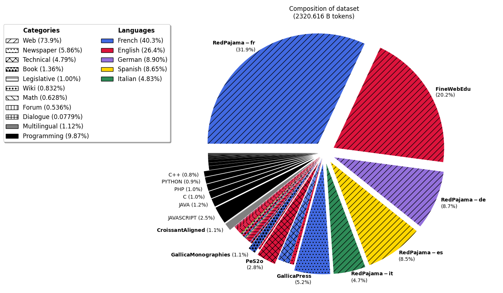

# Lucie Training Dataset Card

The Lucie Training Dataset is a curated collection of text data
in English, French, German, Spanish and Italian culled from a variety of sources including: web data, video subtitles, academic papers,
digital books, newspapers, and magazines, some of which were processed by Optical Character Recognition (OCR). It also contains samples of diverse programming languages.

The Lucie Training Dataset was used to pretrain [Lucie-7B](https://huggingface.co/OpenLLM-France/Lucie-7B),
a foundation LLM with strong capabilities in French and English. Code for data preparation can be found in the [training respository](https://github.com/OpenLLM-France/Lucie-Training/tree/7f1f7efa1288f709662a9067bf2c3db856b850f8) for Lucie-7B. Due to the licenses of a few subcorpora, the Lucie Training Dataset is released under a [CC BY-NC-SA 4.0](https://creativecommons.org/licenses/by-nc-sa/4.0/). A subset available for commercial use will be released soon.

Table of Contents:
<ul>
  <li><a href="#dataset-description">Dataset Description</a>
    <ul>
        <li><a href="#sample-metadata">Sample Metadata</a></li>
        <li><a href="#dataset-composition">Dataset Composition</a>
          <table>
            <tr>
              <td style="vertical-align: top;">
                <ul>
                  <li><a href="#category-web">                      Web</a></li>
                  <li><a href="#category-newspaper">                Newspaper</a></li>
                  <li><a href="#category-technical">                Technical</a></li>
                  <li><a href="#category-book">                     Book</a></li>
                </ul>
              </td>
              <td style="vertical-align: top;">
                <ul>
                  <li><a href="#category-legislative-texts">        Legislative Texts</a></li>
                  <li><a href="#category-legislative-transcripts">  Legislative Transcripts</a></li>
                  <li><a href="#category-wiki">                     Wiki</a></li>
                  <li><a href="#category-math">                     Math</a></li>
                </ul>
              </td>
              <td style="vertical-align: top;">
                <ul>
                  <li><a href="#category-forum">                    Forum</a></li>
                  <li><a href="#category-dialogue">                 Dialogue</a></li>
                  <li><a href="#category-multilingual-parallel-corpora">Multilingual Parallel Corpora</a></li>
                  <li><a href="#category-programming">              Programming</a></li>
                </ul>
              </td>
            </tr>
          </table>
        </li>
        <li><a href="#configurable-subsets-and-versions">Configurable Subsets and Versions</a></li>
        <li><a href="#details-on-data-sources">Details on Data Sources</a>
          <table>
            <tr>
              <td style="vertical-align: top;">
                <ul>
                  <li><a href="#amendementsparlement">              AmendementsParlement</a></li>
                  <li><a href="#americanstories">                   AmericanStories</a></li>
                  <li><a href="#claire-french-and-english">         Claire (French and English)</a></li>
                  <li><a href="#croissantaligned">                  CroissantAligned</a></li>
                  <li><a href="#discourspublics">                   DiscoursPublics</a></li>
                  <li><a href="#europarl-and-europarlaligned">      Europarl and EuroparlAligned</a></li>
                  <li><a href="#eurovoc">                           Eurovoc</a></li>
                  <li><a href="#finewebedu">                        FineWebEdu</a></li>
                  <li><a href="#gallicamonographies">               GallicaMonographies</a></li>
                </ul>
              </td>
              <td style="vertical-align: top;">
                <ul>
                  <li><a href="#gallicapress">                      GallicaPress</a></li>
                  <li><a href="#gutenberg">                         Gutenberg</a></li>
                  <li><a href="#hal">                               HAL</a></li>
                  <li><a href="#interventionsparlement">            InterventionsParlement</a></li>
                  <li><a href="#legi">                              LEGI</a></li>
                  <li><a href="#mathpile-commercial">               MathPile (Commercial)</a></li>
                  <li><a href="#opendata">                          OpenData</a></li>
                  <li><a href="#openedition">                       OpenEdition</a></li>
                  <li><a href="#pes2o-v2">                          PeS2o (v2)</a></li>
                </ul>
              </td>
              <td style="vertical-align: top;">
                <ul>
                  <li><a href="#pile-uncopyrighted">                Pile (Uncopyrighted)</a></li>
                  <li><a href="#questionsecritesparlement">         QuestionsEcritesParlement</a></li>
                  <li><a href="#redpajama-v2">                      RedPajama (v2)</a></li>
                  <li><a href="#stac">                              Stac</a></li>
                  <li><a href="#thestack-v12">                      TheStack (v1.2)</a></li>
                  <li><a href="#theses">                            Theses</a></li>
                  <li><a href="#wikipedia-wikisource-wiktionary">   Wikipedia, Wikisource, Wiktionary</a></li>
                  <li><a href="#youtube">                           YouTube</a></li>
                </ul>
              </td>
            </tr>
          </table>
      </li>
    </ul>
  </li>
  <li><a href="#example-use-in-python">Example use in Python</a></li>
    <ul>
      <li><a href="#load-the-dataset">Load the dataset</a></li>
      <li><a href="#iterate-over-a-subset">Iterate over a subset</a></li>
      <li><a href="#load-a-specific-version">Load a specific version</a></li>
    </ul>
  </li>
  <li><a href="#citation">Citation</a></li>
  <li><a href="#acknowledgements">Acknowledgements</a></li>
  <li><a href="#contact">Contact</a></li>
</ul>


## Dataset Description

This dataset is intended to provide extensive and diverse multilingual data  for training Large Language Models (LLMs). Here are some of the principal features of the corpus:
* Data mix:
    * The dataset contains more French than English data -- it is in fact one of the biggest collections of French text data that has been preprocessed for LLM training -- with the aim of minimizing anglo-centric cultural biases.
    * German, Spanish and Italian are also represented in small amounts.
    * Code is included to boost the reasoning capabilities of LLMs.
* Data filtering and deduplication:
    * The dataset has been cleaned in an effort to remove very low-quality data.
    * Duplicate data samples have been removed to some extent, following best practices.
    * Web data has been filtered to minimize potentially toxic content and personally identifying information. 
* Ethics:
    * Special care has been taken to respect copyright laws and individual privacy.
      All newspapers, monographies, magazines and legislative documents, as well as most books, are in the public domain
  (which depends on the author's date of death and the country of publication). Other data are published with permissive licenses (e.g., CC BY or CC BY-SA) or, in very rare cases, CC BY-NC-SA.
    * All web data in the dataset come from sites with robots.txt files that do not forbid crawling.

### Sample Metadata

In addition to the `text` field, which provides the content of the sample, each training sample in the corpus contains the following metadata when available:
* [`language`](metadata/metadata_examples.json#L3): the language of the text sample (note that this information is taken from the original data source and may be incorrect).
  <br>Possible values:
  - the ISO 639-1 code for a given natural language ("en", "fr", "de", "es", or "it"),
  - the name of a programming language prefixed by "code:" ("code:python", "code:c++", …), or
  - a list of ISO 639-1 codes separated by commas for data containing parallel translations ("fr,en", "de,fr", "es,en", "it,en",
  or one of those pairs in the opposite order if the languages appear in the opposite order in the text).
* [`source`](metadata/metadata_examples.json#L4): an identifier for the source(s) of the text sample (Wikipedia, RedPajama, Gutenberg, …).
  All sources are described in detail [below](#details-on-data-sources).
* [`id`](metadata/metadata_examples.json#L13): an identifier that is unique among documents from the same source.
* [`url`](metadata/metadata_examples.json#L35) (optional): the URL of the original text sample on the web, if available.
* [`title`](metadata/metadata_examples.json#L36) (optional): the title of the original text sample, if available.
* [`author`](metadata/metadata_examples.json#L81) (optional): the author of the original text sample, if available.
  <details><summary>Note:</summary>
  The author name is given in plain text, except in the case of <a href="metadata/metadata_examples.json#L91">Gutenberg books</a>, where it is the JSON serialized object of the author metadata. 
  </details>
* [`date`](metadata/metadata_examples.json#L6) (optional): the publication date of the original text sample, if available.
  <details><summary>Note:</summary>
  The text format of the date depends on the source.
  </details>
* [`quality_signals`](metadata/metadata_examples.json#L17) (optional): a list of quality signals for the text sample in JSON format (which could be used for further filtering or sample weighting).
  <details><summary>Note:</summary>
  It can include indicators computed by `fasttext` and `CCNet`, statistics about occurrences of characters, words, special characters, etc.
  </details>
* [`extra`](metadata/metadata_examples.json#L16) (optional): extra information about the text sample, in JSON format.
  This can include metadata about the source subset, the rights, etc.

The list of metadata available for each source is provided (without the `text` field) in [metadata_examples.json](metadata/metadata_examples.json).


### Dataset Composition

The following figure shows the distribution of the dataset by language (colors) and category (hatch patterns).



The following table provides an overview of the dataset composition,
broken down by source and language.
Sources are grouped by category.
The table provides the numbers of documents, words, tokens, and characters for each subset.
All numbers in this table are available in the CSV file [dataset_composition.csv](metadata/dataset_composition.csv).
Token counts are computed using the tokenizer for [Lucie-7B](https://huggingface.co/OpenLLM-France/Lucie-7B).

<!-- The following is automatically generated. Do not update manually. -->
<!-- TABLE START -->
<table>
<thead>
<tr>
<th><strong>Subset</strong></th>
<th><strong>Language</strong></th>
<th><strong>M docs</strong></th>
<th><strong>B words</strong></th>
<th><strong>B tokens</strong></th>
<th><strong>B chars</strong></th>
<th></th>
</tr>
</thead>
<tbody>
<tr>
<td rowspan="11" style="vertical-align: top;"><strong>TOTAL</strong></td>
<td></td>
<td>2186.562</td>
<td>1356.021</td>
<td>2314.862</td>
<td>8842.200</td>
<td></td>
</tr>
<tr>

<td><strong>French (fr)</strong></td>
<td>653.812</td>
<td>583.687</td>
<td>928.618</td>
<td>3619.672</td>
<td><a href="https://huggingface.co/datasets/OpenLLM-France/Lucie-Training-Dataset/blob/main/figures/fig_distribution_french_pie.png">composition details</a></td>
</tr>
<tr>

<td><strong>English (en)</strong></td>
<td>554.289</td>
<td>412.202</td>
<td>611.894</td>
<td>2553.541</td>
<td><a href="https://huggingface.co/datasets/OpenLLM-France/Lucie-Training-Dataset/blob/main/figures/fig_distribution_english_pie.png">composition details</a></td>
</tr>
<tr>

<td><strong>code</strong></td>
<td>125.769</td>
<td>51.306</td>
<td>228.954</td>
<td>630.749</td>
<td><a href="https://huggingface.co/datasets/OpenLLM-France/Lucie-Training-Dataset/blob/main/figures/fig_distribution_code_pie.png">composition details</a></td>
</tr>
<tr>

<td><strong>German (de)</strong></td>
<td>165.915</td>
<td>105.609</td>
<td>206.610</td>
<td>764.779</td>
<td><a href="https://huggingface.co/datasets/OpenLLM-France/Lucie-Training-Dataset/blob/main/figures/fig_distribution_german_pie.png">composition details</a></td>
</tr>
<tr>

<td><strong>Spanish (es)</strong></td>
<td>171.651</td>
<td>123.857</td>
<td>200.825</td>
<td>759.457</td>
<td><a href="https://huggingface.co/datasets/OpenLLM-France/Lucie-Training-Dataset/blob/main/figures/fig_distribution_spanish_pie.png">composition details</a></td>
</tr>
<tr>

<td><strong>Italian (it)</strong></td>
<td>99.440</td>
<td>62.051</td>
<td>112.031</td>
<td>404.454</td>
<td><a href="https://huggingface.co/datasets/OpenLLM-France/Lucie-Training-Dataset/blob/main/figures/fig_distribution_italian_pie.png">composition details</a></td>
</tr>
<tr>

<td><strong>fr-en</strong></td>
<td>410.032</td>
<td>17.016</td>
<td>25.494</td>
<td>107.658</td>
<td><a href="https://huggingface.co/datasets/OpenLLM-France/Lucie-Training-Dataset/blob/main/figures/fig_distribution_fr-en_pie.png">composition details</a></td>
</tr>
<tr>

<td><strong>it-en</strong></td>
<td>1.901</td>
<td>0.100</td>
<td>0.151</td>
<td>0.638</td>
<td></td>
</tr>
<tr>

<td><strong>es-en</strong></td>
<td>1.961</td>
<td>0.103</td>
<td>0.143</td>
<td>0.631</td>
<td></td>
</tr>
<tr>

<td><strong>de-fr</strong></td>
<td>1.792</td>
<td>0.0908</td>
<td>0.141</td>
<td>0.621</td>
<td></td>
</tr>
<tr>
<td colspan="7"><h4 id="category-web">Category: Web</h4></td></tr>
<tr>
<td rowspan="4" style="vertical-align: top;"><a href="#redpajama-v2"><strong>RedPajama</strong></a></td>
<td><strong>French (fr)</strong></td>
<td>640.770</td>
<td>477.758</td>
<td>741.023</td>
<td>2974.596</td>
<td><a href="https://huggingface.co/datasets/OpenLLM-France/Lucie-Training-Dataset/blob/main/figures/fig_distribution_redpajama-french_histogram.png">composition details</a></td>
</tr>
<tr>

<td><strong>German (de)</strong></td>
<td>162.779</td>
<td>103.078</td>
<td>201.371</td>
<td>747.631</td>
<td><a href="https://huggingface.co/datasets/OpenLLM-France/Lucie-Training-Dataset/blob/main/figures/fig_distribution_redpajama-german_histogram.png">composition details</a></td>
</tr>
<tr>

<td><strong>Spanish (es)</strong></td>
<td>169.447</td>
<td>121.751</td>
<td>197.125</td>
<td>746.984</td>
<td><a href="https://huggingface.co/datasets/OpenLLM-France/Lucie-Training-Dataset/blob/main/figures/fig_distribution_redpajama-spanish_histogram.png">composition details</a></td>
</tr>
<tr>

<td><strong>Italian (it)</strong></td>
<td>97.324</td>
<td>60.194</td>
<td>108.416</td>
<td>393.012</td>
<td><a href="https://huggingface.co/datasets/OpenLLM-France/Lucie-Training-Dataset/blob/main/figures/fig_distribution_redpajama-italian_histogram.png">composition details</a></td>
</tr>
<tr>
<td><a href="#finewebedu"><strong>FineWebEdu</strong></a></td>
<td><strong>English (en)</strong></td>
<td>421.209</td>
<td>327.453</td>
<td>467.837</td>
<td>2018.215</td>
<td><a href="https://huggingface.co/datasets/OpenLLM-France/Lucie-Training-Dataset/blob/main/figures/fig_distribution_finewebedu-english_histogram.png">composition details</a></td>
</tr>
<tr>
<td colspan="7"><h4 id="category-newspaper">Category: Newspaper</h4></td></tr>
<tr>
<td><a href="#gallicapress"><strong>GallicaPress</strong></a></td>
<td><strong>French (fr)</strong></td>
<td>3.205</td>
<td>67.496</td>
<td>121.606</td>
<td>408.882</td>
<td></td>
</tr>
<tr>
<td><a href="#americanstories"><strong>AmericanStories</strong></a></td>
<td><strong>English (en)</strong></td>
<td>59.420</td>
<td>8.902</td>
<td>14.313</td>
<td>50.844</td>
<td><a href="https://huggingface.co/datasets/OpenLLM-France/Lucie-Training-Dataset/blob/main/figures/fig_distribution_americanstories-english_histogram.png">composition details</a></td>
</tr>
<tr>
<td colspan="7"><h4 id="category-technical">Category: Technical</h4></td></tr>
<tr>
<td><a href="#pes2o-v2"><strong>PeS2o</strong></a></td>
<td><strong>English (en)</strong></td>
<td>38.972</td>
<td>42.296</td>
<td>65.365</td>
<td>268.963</td>
<td></td>
</tr>
<tr>
<td><a href="#hal"><strong>HAL</strong></a></td>
<td><strong>French (fr)</strong></td>
<td>0.349</td>
<td>9.356</td>
<td>16.224</td>
<td>58.308</td>
<td></td>
</tr>
<tr>
<td><a href="#theses"><strong>Theses</strong></a></td>
<td><strong>French (fr)</strong></td>
<td>0.102</td>
<td>7.547</td>
<td>14.060</td>
<td>47.758</td>
<td></td>
</tr>
<tr>
<td><a href="#pile-uncopyrighted"><strong>Pile (USPTO_Backgrounds)</strong></a></td>
<td><strong>English (en)</strong></td>
<td>5.139</td>
<td>3.492</td>
<td>5.105</td>
<td>22.309</td>
<td></td>
</tr>
<tr>
<td><a href="#openedition"><strong>OpenEdition</strong></a></td>
<td><strong>French (fr)</strong></td>
<td>0.939</td>
<td>2.225</td>
<td>3.604</td>
<td>14.459</td>
<td></td>
</tr>
<tr>
<td><a href="#pile-uncopyrighted"><strong>Pile (PhilPapers)</strong></a></td>
<td><strong>English (en)</strong></td>
<td>0.0308</td>
<td>0.363</td>
<td>0.618</td>
<td>2.304</td>
<td></td>
</tr>
<tr>
<td><a href="#pile-uncopyrighted"><strong>Pile (NIH_ExPorter)</strong></a></td>
<td><strong>English (en)</strong></td>
<td>0.914</td>
<td>0.288</td>
<td>0.431</td>
<td>1.979</td>
<td></td>
</tr>
<tr>
<td colspan="7"><h4 id="category-book">Category: Book</h4></td></tr>
<tr>
<td><a href="#gallicamonographies"><strong>GallicaMonographies</strong></a></td>
<td><strong>French (fr)</strong></td>
<td>0.278</td>
<td>15.106</td>
<td>25.169</td>
<td>90.456</td>
<td></td>
</tr>
<tr>
<td rowspan="5" style="vertical-align: top;"><a href="#gutenberg"><strong>Gutenberg</strong></a></td>
<td><strong>English (en)</strong></td>
<td>0.0563</td>
<td>3.544</td>
<td>5.516</td>
<td>20.579</td>
<td></td>
</tr>
<tr>

<td><strong>French (fr)</strong></td>
<td>0.00345</td>
<td>0.227</td>
<td>0.383</td>
<td>1.392</td>
<td></td>
</tr>
<tr>

<td><strong>German (de)</strong></td>
<td>0.00188</td>
<td>0.0987</td>
<td>0.193</td>
<td>0.654</td>
<td></td>
</tr>
<tr>

<td><strong>Italian (it)</strong></td>
<td>0.000958</td>
<td>0.0657</td>
<td>0.129</td>
<td>0.414</td>
<td></td>
</tr>
<tr>

<td><strong>Spanish (es)</strong></td>
<td>0.000735</td>
<td>0.0512</td>
<td>0.0920</td>
<td>0.303</td>
<td></td>
</tr>
<tr>
<td colspan="7"><h4 id="category-legislative-texts">Category: Legislative Texts</h4></td></tr>
<tr>
<td><a href="#pile-uncopyrighted"><strong>Pile (FreeLaw)</strong></a></td>
<td><strong>English (en)</strong></td>
<td>3.415</td>
<td>8.204</td>
<td>14.011</td>
<td>52.580</td>
<td></td>
</tr>
<tr>
<td rowspan="4" style="vertical-align: top;"><a href="#eurovoc"><strong>Eurovoc</strong></a></td>
<td><strong>English (en)</strong></td>
<td>0.272</td>
<td>1.523</td>
<td>2.571</td>
<td>9.468</td>
<td></td>
</tr>
<tr>

<td><strong>Italian (it)</strong></td>
<td>0.245</td>
<td>0.731</td>
<td>1.527</td>
<td>4.867</td>
<td></td>
</tr>
<tr>

<td><strong>German (de)</strong></td>
<td>0.247</td>
<td>0.678</td>
<td>1.497</td>
<td>4.915</td>
<td></td>
</tr>
<tr>

<td><strong>Spanish (es)</strong></td>
<td>0.246</td>
<td>0.757</td>
<td>1.411</td>
<td>4.684</td>
<td></td>
</tr>
<tr>
<td><a href="#opendata"><strong>OpenData</strong></a></td>
<td><strong>French (fr)</strong></td>
<td>1.169</td>
<td>0.755</td>
<td>1.209</td>
<td>4.638</td>
<td></td>
</tr>
<tr>
<td><a href="#questionsecritesparlement"><strong>QuestionsEcritesParlement</strong></a></td>
<td><strong>French (fr)</strong></td>
<td>0.189</td>
<td>0.108</td>
<td>0.156</td>
<td>0.705</td>
<td></td>
</tr>
<tr>
<td><a href="#legi"><strong>LEGI</strong></a></td>
<td><strong>French (fr)</strong></td>
<td>0.621</td>
<td>0.0878</td>
<td>0.145</td>
<td>0.563</td>
<td></td>
</tr>
<tr>
<td><a href="#amendementsparlement"><strong>AmendementsParlement</strong></a></td>
<td><strong>French (fr)</strong></td>
<td>0.673</td>
<td>0.0452</td>
<td>0.0738</td>
<td>0.274</td>
<td></td>
</tr>
<tr>
<td colspan="7"><h4 id="category-legislative-transcripts">Category: Legislative Transcripts</h4></td></tr>
<tr>
<td rowspan="4" style="vertical-align: top;"><a href="#europarl-and-europarlaligned"><strong>Europarl</strong></a></td>
<td><strong>German (de)</strong></td>
<td>0.0102</td>
<td>0.0451</td>
<td>0.0734</td>
<td>0.327</td>
<td></td>
</tr>
<tr>

<td><strong>Spanish (es)</strong></td>
<td>0.0103</td>
<td>0.0524</td>
<td>0.0733</td>
<td>0.325</td>
<td></td>
</tr>
<tr>

<td><strong>French (fr)</strong></td>
<td>0.0103</td>
<td>0.0528</td>
<td>0.0717</td>
<td>0.339</td>
<td></td>
</tr>
<tr>

<td><strong>English (en)</strong></td>
<td>0.0111</td>
<td>0.0563</td>
<td>0.0690</td>
<td>0.339</td>
<td></td>
</tr>
<tr>
<td><a href="#discourspublics"><strong>DiscoursPublics</strong></a></td>
<td><strong>French (fr)</strong></td>
<td>0.110</td>
<td>0.163</td>
<td>0.238</td>
<td>1.025</td>
<td></td>
</tr>
<tr>
<td><a href="#interventionsparlement"><strong>InterventionsParlement</strong></a></td>
<td><strong>French (fr)</strong></td>
<td>1.832</td>
<td>0.104</td>
<td>0.157</td>
<td>0.654</td>
<td></td>
</tr>
<tr>
<td colspan="7"><h4 id="category-wiki">Category: Wiki</h4></td></tr>
<tr>
<td rowspan="5" style="vertical-align: top;"><a href="#wikipedia-wikisource-wiktionary"><strong>Wikipedia</strong></a></td>
<td><strong>English (en)</strong></td>
<td>6.893</td>
<td>4.708</td>
<td>7.898</td>
<td>26.616</td>
<td></td>
</tr>
<tr>

<td><strong>German (de)</strong></td>
<td>2.877</td>
<td>1.709</td>
<td>3.476</td>
<td>11.252</td>
<td></td>
</tr>
<tr>

<td><strong>French (fr)</strong></td>
<td>2.648</td>
<td>1.726</td>
<td>2.940</td>
<td>9.879</td>
<td></td>
</tr>
<tr>

<td><strong>Spanish (es)</strong></td>
<td>1.947</td>
<td>1.245</td>
<td>2.124</td>
<td>7.161</td>
<td></td>
</tr>
<tr>

<td><strong>Italian (it)</strong></td>
<td>1.870</td>
<td>1.060</td>
<td>1.959</td>
<td>6.161</td>
<td></td>
</tr>
<tr>
<td><a href="#wikipedia-wikisource-wiktionary"><strong>wikisource</strong></a></td>
<td><strong>French (fr)</strong></td>
<td>0.186</td>
<td>0.523</td>
<td>0.795</td>
<td>3.080</td>
<td></td>
</tr>
<tr>
<td><a href="#wikipedia-wikisource-wiktionary"><strong>wiktionary</strong></a></td>
<td><strong>French (fr)</strong></td>
<td>0.650</td>
<td>0.0531</td>
<td>0.117</td>
<td>0.347</td>
<td></td>
</tr>
<tr>
<td colspan="7"><h4 id="category-math">Category: Math</h4></td></tr>
<tr>
<td><a href="#mathpile-commercial"><strong>MathPile</strong></a></td>
<td><strong>English (en)</strong></td>
<td>0.737</td>
<td>3.408</td>
<td>9.637</td>
<td>27.290</td>
<td></td>
</tr>
<tr>
<td><a href="#pile-uncopyrighted"><strong>Pile (DM_Mathematics)</strong></a></td>
<td><strong>English (en)</strong></td>
<td>0.992</td>
<td>1.746</td>
<td>4.928</td>
<td>8.127</td>
<td></td>
</tr>
<tr>
<td colspan="7"><h4 id="category-forum">Category: Forum</h4></td></tr>
<tr>
<td><a href="#pile-uncopyrighted"><strong>Pile (StackExchange)</strong></a></td>
<td><strong>English (en)</strong></td>
<td>15.269</td>
<td>4.534</td>
<td>10.275</td>
<td>33.609</td>
<td></td>
</tr>
<tr>
<td><a href="#pile-uncopyrighted"><strong>Pile (Ubuntu_IRC)</strong></a></td>
<td><strong>English (en)</strong></td>
<td>0.0104</td>
<td>0.867</td>
<td>2.159</td>
<td>5.610</td>
<td></td>
</tr>
<tr>
<td colspan="7"><h4 id="category-dialogue">Category: Dialogue</h4></td></tr>
<tr>
<td rowspan="2" style="vertical-align: top;"><a href="#claire-french-and-english"><strong>Claire</strong></a></td>
<td><strong>English (en)</strong></td>
<td>0.949</td>
<td>0.818</td>
<td>1.161</td>
<td>4.709</td>
<td><a href="https://huggingface.co/datasets/OpenLLM-France/Lucie-Training-Dataset/blob/main/figures/fig_distribution_claire-english_pie.png">composition details</a></td>
</tr>
<tr>

<td><strong>French (fr)</strong></td>
<td>0.0393</td>
<td>0.210</td>
<td>0.311</td>
<td>1.314</td>
<td><a href="https://huggingface.co/datasets/OpenLLM-France/Lucie-Training-Dataset/blob/main/figures/fig_distribution_claire-french_pie.png">composition details</a></td>
</tr>
<tr>
<td><a href="#youtube"><strong>YouTube</strong></a></td>
<td><strong>French (fr)</strong></td>
<td>0.0375</td>
<td>0.145</td>
<td>0.336</td>
<td>1.003</td>
<td></td>
</tr>
<tr>
<td><a href="#stac"><strong>STAC</strong></a></td>
<td><strong>English (en)</strong></td>
<td>0.0000450</td>
<td>0.0000529</td>
<td>0.000121</td>
<td>0.000327</td>
<td></td>
</tr>
<tr>
<td colspan="7"><h4 id="category-multilingual-parallel-corpora">Category: Multilingual Parallel Corpora</h4></td></tr>
<tr>
<td><a href="#croissantaligned"><strong>CroissantAligned</strong></a></td>
<td><strong>fr-en</strong></td>
<td>408.029</td>
<td>16.911</td>
<td>25.351</td>
<td>107.003</td>
<td></td>
</tr>
<tr>
<td rowspan="4" style="vertical-align: top;"><a href="#europarl-and-europarlaligned"><strong>EuroparlAligned</strong></a></td>
<td><strong>it-en</strong></td>
<td>1.901</td>
<td>0.100</td>
<td>0.151</td>
<td>0.638</td>
<td></td>
</tr>
<tr>

<td><strong>fr-en</strong></td>
<td>2.003</td>
<td>0.105</td>
<td>0.143</td>
<td>0.655</td>
<td></td>
</tr>
<tr>

<td><strong>es-en</strong></td>
<td>1.961</td>
<td>0.103</td>
<td>0.143</td>
<td>0.631</td>
<td></td>
</tr>
<tr>

<td><strong>de-fr</strong></td>
<td>1.792</td>
<td>0.0908</td>
<td>0.141</td>
<td>0.621</td>
<td></td>
</tr>
<tr>
<td colspan="7"><h4 id="category-programming">Category: Programming</h4></td></tr>
<tr>
<td rowspan="30" style="vertical-align: top;"><a href="#thestack-v12"><strong>TheStack</strong></a></td>
<td><strong>JAVASCRIPT</strong></td>
<td>21.109</td>
<td>8.526</td>
<td>58.609</td>
<td>141.647</td>
<td></td>
</tr>
<tr>

<td><strong>JAVA</strong></td>
<td>20.152</td>
<td>7.421</td>
<td>27.680</td>
<td>89.297</td>
<td></td>
</tr>
<tr>

<td><strong>C</strong></td>
<td>8.626</td>
<td>5.916</td>
<td>24.092</td>
<td>57.428</td>
<td></td>
</tr>
<tr>

<td><strong>PHP</strong></td>
<td>15.905</td>
<td>4.865</td>
<td>22.883</td>
<td>66.844</td>
<td></td>
</tr>
<tr>

<td><strong>PYTHON</strong></td>
<td>12.962</td>
<td>5.434</td>
<td>21.683</td>
<td>64.304</td>
<td></td>
</tr>
<tr>

<td><strong>C++</strong></td>
<td>6.378</td>
<td>4.584</td>
<td>18.835</td>
<td>50.892</td>
<td></td>
</tr>
<tr>

<td><strong>C#</strong></td>
<td>10.839</td>
<td>3.574</td>
<td>13.381</td>
<td>46.286</td>
<td></td>
</tr>
<tr>

<td><strong>GO</strong></td>
<td>4.730</td>
<td>2.735</td>
<td>10.262</td>
<td>25.738</td>
<td></td>
</tr>
<tr>

<td><strong>TYPESCRIPT</strong></td>
<td>10.637</td>
<td>2.617</td>
<td>9.836</td>
<td>28.815</td>
<td></td>
</tr>
<tr>

<td><strong>RUST</strong></td>
<td>1.387</td>
<td>0.872</td>
<td>3.241</td>
<td>9.529</td>
<td></td>
</tr>
<tr>

<td><strong>RUBY</strong></td>
<td>3.405</td>
<td>0.646</td>
<td>2.392</td>
<td>7.139</td>
<td></td>
</tr>
<tr>

<td><strong>SWIFT</strong></td>
<td>1.756</td>
<td>0.553</td>
<td>1.876</td>
<td>6.134</td>
<td></td>
</tr>
<tr>

<td><strong>KOTLIN</strong></td>
<td>2.243</td>
<td>0.454</td>
<td>1.758</td>
<td>5.769</td>
<td></td>
</tr>
<tr>

<td><strong>SCALA</strong></td>
<td>1.362</td>
<td>0.457</td>
<td>1.587</td>
<td>4.862</td>
<td></td>
</tr>
<tr>

<td><strong>TEX</strong></td>
<td>0.398</td>
<td>0.394</td>
<td>1.507</td>
<td>3.805</td>
<td></td>
</tr>
<tr>

<td><strong>LUA</strong></td>
<td>0.559</td>
<td>0.318</td>
<td>1.367</td>
<td>3.279</td>
<td></td>
</tr>
<tr>

<td><strong>DART</strong></td>
<td>0.933</td>
<td>0.308</td>
<td>1.242</td>
<td>3.864</td>
<td></td>
</tr>
<tr>

<td><strong>PERL</strong></td>
<td>0.392</td>
<td>0.297</td>
<td>1.149</td>
<td>2.634</td>
<td></td>
</tr>
<tr>

<td><strong>MATHEMATICA</strong></td>
<td>0.0269</td>
<td>0.120</td>
<td>1.117</td>
<td>1.720</td>
<td></td>
</tr>
<tr>

<td><strong>ASSEMBLY</strong></td>
<td>0.248</td>
<td>0.209</td>
<td>0.867</td>
<td>1.575</td>
<td></td>
</tr>
<tr>

<td><strong>HASKELL</strong></td>
<td>0.545</td>
<td>0.307</td>
<td>0.807</td>
<td>2.364</td>
<td></td>
</tr>
<tr>

<td><strong>FORTRAN</strong></td>
<td>0.165</td>
<td>0.192</td>
<td>0.780</td>
<td>1.843</td>
<td></td>
</tr>
<tr>

<td><strong>JULIA</strong></td>
<td>0.299</td>
<td>0.152</td>
<td>0.660</td>
<td>1.539</td>
<td></td>
</tr>
<tr>

<td><strong>OCAML</strong></td>
<td>0.160</td>
<td>0.130</td>
<td>0.430</td>
<td>1.107</td>
<td></td>
</tr>
<tr>

<td><strong>ERLANG</strong></td>
<td>0.0994</td>
<td>0.0657</td>
<td>0.260</td>
<td>0.726</td>
<td></td>
</tr>
<tr>

<td><strong>ELIXIR</strong></td>
<td>0.282</td>
<td>0.0731</td>
<td>0.258</td>
<td>0.737</td>
<td></td>
</tr>
<tr>

<td><strong>CLOJURE</strong></td>
<td>0.126</td>
<td>0.0448</td>
<td>0.179</td>
<td>0.492</td>
<td></td>
</tr>
<tr>

<td><strong>R</strong></td>
<td>0.0392</td>
<td>0.0278</td>
<td>0.158</td>
<td>0.305</td>
<td></td>
</tr>
<tr>

<td><strong>MATLAB</strong></td>
<td>0.000967</td>
<td>0.00865</td>
<td>0.0427</td>
<td>0.0372</td>
<td></td>
</tr>
<tr>

<td><strong>RACKET</strong></td>
<td>0.00420</td>
<td>0.00479</td>
<td>0.0153</td>
<td>0.0378</td>
<td></td>
</tr>
</tbody>
</table>
<!-- TABLE END -->


### Configurable Subsets and Versions

As the Lucie Training Dataset is a collection of multilingual corpora from different sources, it can be divided into subsets based on the source and language of its constituent corpora.
<br> The list of possible configurations is available [in the YAML header of this README file](https://huggingface.co/datasets/OpenLLM-France/Lucie-Training-Dataset/blob/v1.2/README.md?code=true#L24).
Each configuration corresponds to a pathname pattern in the [data subdirectory](https://huggingface.co/datasets/OpenLLM-France/Lucie-Training-Dataset/tree/v1.2/data).

The dataset is also  available in the following versions:
- **v1.1** / [**main**](https://huggingface.co/datasets/OpenLLM-France/Lucie-Training-Dataset/tree/main/data) (default): 
  The data used for the first (main) pretraining phase of [Lucie-7B](https://huggingface.co/OpenLLM-France/Lucie-7B), which contains approximately 2.3T tokens. The statistics above apply to this version.
- [**v1.2**](https://huggingface.co/datasets/OpenLLM-France/Lucie-Training-Dataset/tree/v1.2/data): An improved version of the main dataset, where 
  - GallicaMonographies and GallicaPress have been fltered aggressively to remove documents with low OCR quality.
  - The `Ubuntu_IRC` and `PhilPapers` subsets of Pile have been refined by fixing encoding issues and removing documents in languages other than English, French, Spanish, German and Italian.
- [**v1.2-recent-web**](https://huggingface.co/datasets/OpenLLM-France/Lucie-Training-Dataset/tree/v1.2-recent-web/data) : The data used for the second pretraining phase (context extension) of [Lucie-7B](https://huggingface.co/OpenLLM-France/Lucie-7B#2-context-extension).
  This version is identical to `v1.2` with the exception that older snapshots of web data (before 2023 for RedPajama and before 2024 for FineWebEdu) have been excluded.
  All data from `v1.1` that were not filtered out remain unchanged in `v1.2` and `v1.2-recent-web`.

Except from **v1.1**, which is a git tag, all versions are git branches in the dataset repository
(e.g. [**v1.2**](https://huggingface.co/datasets/OpenLLM-France/Lucie-Training-Dataset/tree/v1.2/data)).

The <a href="#example-use-in-python">Example use in Python</a> section contains example Python code for loading and iterating over the dataset with different configurations, including source, language and version.


### Details on Data Sources

#### AmendementsParlement
* <u>Source</u>: Corpus contributed by OpenLLM partners.
* <u>Extracted from</u>:  [Regards citoyens](https://www.regardscitoyens.org/#&panel1-4). License: [CC BY-SA](https://www.regardscitoyens.org/mentions-legales/).
* <u>Description</u>: A collection of proposed amendments by the French parliament. Documents contain the text of the proposed amendment, the name of the associated law as well as information on who voted on the amendment and what was decided.

#### AmericanStories
* <u>Source</u>: [dell-research-harvard/AmericanStories](https://huggingface.co/datasets/dell-research-harvard/AmericanStories). License: [CC BY 4.0](https://huggingface.co/datasets/dell-research-harvard/AmericanStories).
* <u>Extracted from</u>: [Chronicling America](https://www.loc.gov/collections/chronicling-america/about-this-collection/). License: [Open](https://www.loc.gov/collections/chronicling-america/about-this-collection/rights-and-access/).
* <u>Description</u>: "The American Stories dataset is a collection of full article texts extracted from historical U.S. newspaper images. It includes nearly 20 million scans from the public domain Chronicling America collection maintained by the Library of Congress. The dataset is designed to address the challenges posed by complex layouts and low OCR quality in existing newspaper datasets" (from the [dataset card](https://huggingface.co/datasets/dell-research-harvard/AmericanStories)). See the dataset <a href="https://huggingface.co/datasets/OpenLLM-France/Lucie-Training-Dataset/blob/main/figures/fig_distribution_americanstories-english_histogram.png">composition details</a> for statistics on documents by year. Dataset containing text retrieved through OCR.
* <u>Pre-processing</u>:
  * <u>Filtering</u>:
  To filter out documents with excessive OCR errors, the dataset was refined by discarding texts with a perplexity higher than 2310,
  measured using a CCNET model in English (see [code details](https://github.com/OpenLLM-France/Lucie-Training/blob/7f1f7efa1288f709662a9067bf2c3db856b850f8/tokenization/data.py#L2106)).
  The code to compute CCNET perplexity, parallelizing on parquet files, is [available here](https://github.com/OpenLLM-France/Lucie-dataset-filtering).
* <u>Citation</u>: Melissa Dell, Jacob Carlson, Tom Bryan, Emily Silcock, Abhishek Arora, Zejiang Shen, Luca D'Amico-Wong, Quan Le, Pablo Querubin and Leander Heldring (2023). "American Stories: A Large-Scale Structured Text Dataset of Historical U.S. Newspapers," [arxiv:2308.12477](https://arxiv.org/abs/2308.12477v1).

#### Claire (French and English)
* <u>Sources</u>:
  * French dataset: [OpenLLM-France/Claire-Dialogue-French-0.1](https://huggingface.co/datasets/OpenLLM-France/Claire-Dialogue-French-0.1). License: [CC BY-NC-SA 4.0](https://huggingface.co/datasets/OpenLLM-France/Claire-Dialogue-French-0.1).
  * English dataset: [OpenLLM-France/Claire-Dialogue-English-0.1](https://huggingface.co/datasets/OpenLLM-France/Claire-Dialogue-English-0.1). License: [CC BY-NC-SA 4.0](https://huggingface.co/datasets/OpenLLM-France/Claire-Dialogue-English-0.1).
* <u>Extracted from</u>: see the datacards for the [French](https://huggingface.co/datasets/OpenLLM-France/Claire-Dialogue-French-0.1) and [English](https://huggingface.co/datasets/OpenLLM-France/Claire-Dialogue-English-0.1) datasets.
* <u>Description</u>: The Claire datasets are composed of transcripts of spoken conversations -- including parliamentary proceedings, interviews, debates, meetings, and free conversations -- as well as some written conversations from theater plays and written chats. The dataset is designed to help downstream performance of models fine-tuned for tasks requiring the comprehension of spontaneous spoken conversation, such as meeting summarization. Each dialogue is split into speech turns, and each speech turn is labeled with the name of the speaker or a unique identifier. See the composition details for the <a href="https://huggingface.co/datasets/OpenLLM-France/Lucie-Training-Dataset/blob/main/figures/fig_distribution_claire-french_pie.png">French dataset</a> and the <a href="https://huggingface.co/datasets/OpenLLM-France/Lucie-Training-Dataset/blob/main/figures/fig_distribution_claire-english_pie.png">English dataset</a> for a high-level view of the distribution of different types of documents in each dataset.
* <u>Citation</u>: Julie Hunter, Jérôme Louradour, Virgile Rennard, Ismaïl Harrando, Guokan Shang, Jean-Pierre Lorré (2023). The Claire French Dialogue Dataset. [arXiv:2311.16840](https://arxiv.org/abs/2311.16840).

#### CroissantAligned
* <u>Source</u>: [croissantllm/croissant_dataset_no_web_data](https://huggingface.co/datasets/croissantllm/croissant_dataset_no_web_data/tree/main/aligned_36b) (subset: `aligned_36b`). License: not specified.
* <u>Extracted from</u>: 
  * Translation pairs: [OPUS](https://opus.nlpl.eu/) (99.6% of the data in CroissantAligned). Pairs extracted from OPUS are labeled as "UnbabelFrEn". 
  * Thesis abstracts: French thesis abstract pairs. License: [ETALAB-Licence-Ouverte-v2.0](https://www.etalab.gouv.fr/wp-content/uploads/2017/04/ETALAB-Licence-Ouverte-v2.0.pdf).
  * Song lyrics: [lacoccinelle](https://www.lacoccinelle.net). 
* <u>Description</u>: CroissantAligned contains samples of parallel French/English (or English/French) data. Data extracted from OPUS takes the form of sentences pairs, where one sentence is in French and the other is in English. OPUS pairs were passed through a custom pipeline designed to select the highest quality translation examples. Selected pairs are labeled "UnbabelFrEn" in the CroissantAligned dataset. The thesis abstract subset contains thesis abstracts paired with translations written by the thesis authors. The song lyrics are translated by contributors to www.lacoccinelle.net. Parallel data are used to boost the multilingual capabilities of models trained on them ([Faysse et al.,2024](https://arxiv.org/pdf/2402.00786)).
* <u>Pre-processing</u>:
  * <u>Language separation and tagging</u>: The original text field of [the Croissant dataset](https://huggingface.co/datasets/croissantllm/croissant_dataset_no_web_data) contains a sentence or passage in French or English immediately followed by its translation without any indication of which passage is in which language. The first step was thus to split each text into separate, monolingual passages and tag each passage with the appropriate language code, identified automatically using the [langid library](https://pypi.org/project/langid/) (see [code details](https://github.com/OpenLLM-France/Lucie-Training/blob/cdec8fd6369385455829ab39c2f04bcb1a8a475a/tokenization/data.py#L1407)). In the Lucie Training Dataset, the `extra` metadata field for CroissantAligned contains separate keys, `text_fr` for French and `text_en` for English, that stores the texts separately.
  * <u>Random combination of texts prefixed by language</u>: To create the text values, each monolingual text was repaired with its translation, but random separators and various methods of prefixing the text with the language (name or code) were added.
  This was done as a precaution to prevent models trained on this data from switching languages when generating text and can be seen as a very basic instruction to translate the source (first) text into the target (second) text (see [code details](https://github.com/OpenLLM-France/Lucie-Training/blob/cdec8fd6369385455829ab39c2f04bcb1a8a475a/tokenization/data.py#L1458)).
* <u>Citation</u>: Manuel Faysse, Patrick Fernandes, Nuno M. Guerreiro, António Loison, Duarte M. Alves, Caio Corro, Nicolas Boizard, João Alves, Ricardo Rei, Pedro H. Martins, Antoni Bigata Casademunt, François Yvon, André F.T. Martins, Gautier Viaud, Céline Hudelot, Pierre Colombo (2024). "CroissantLLM: A Truly Bilingual French-English Language Model," [arXiv:2402.00786](https://arxiv.org/abs/2402.00786).

#### DiscoursPublics
* <u>Source</u>: Corpus contributed by OpenLLM partners.
* <u>Extracted from</u>: [Vie Publique](https://www.vie-publique.fr/collection-discours-publics). License: [ETALAB-Licence-Ouverte-v2.0](https://www.vie-publique.fr/mentions-legales).
* <u>Description</u>: A collection of public speeches from the principal public actors in France including speeches from the French President starting from 1974 and from the Prime Minister and members of the government starting from 1980.
* <u>Pre-processing</u>:
  * <u>Text cleaning</u>: the mention of the source url and the number of views were removed from the text.

#### Europarl and EuroparlAligned
* <u>Sources</u>: 
  * `fr-en`, `es-en`, `it-en` parallel data: [Europarl v7](https://www.statmt.org/europarl/v7/). License: [Open](https://www.statmt.org/europarl/).
  * `fr`, `en`, `de`, `es` monolingual data and `de-fr` parallel data: [Europarl v10](https://www.statmt.org/europarl/v10/training-monolingual/). License: [Open](https://www.statmt.org/europarl/).
* <u>Description</u>: "The Europarl parallel corpus is extracted from the proceedings of the European Parliament. It includes versions in 21 European languages: Romanic (French, Italian, Spanish, Portuguese, Romanian), Germanic (English, Dutch, German, Danish, Swedish), Slavik (Bulgarian, Czech, Polish, Slovak, Slovene), Finni-Ugric (Finnish, Hungarian, Estonian), Baltic (Latvian, Lithuanian), and Greek. The goal of the extraction and processing was to generate sentence aligned text for statistical machine translation systems" ([www.statmt.org](https://www.statmt.org/europarl/)).
* <u>Pre-processing</u>:
  * <u>Random combination of aligned texts prefixed by language</u>: The same process as used for the [CroissantAligned](#croissantaligned) dataset was applied to the EuroparlAligned dataset (see [code details](https://github.com/OpenLLM-France/Lucie-Training/blob/cdec8fd6369385455829ab39c2f04bcb1a8a475a/tokenization/data.py#L1350)).
  In the Lucie Training Dataset, the `extra` field in the metadata for EuroparlAligned provides texts in the two languages under the sub-fields `text_1` and `text_2`, and the corresponding language codes under `lang_1` and `lang_2`.
* <u>Citation</u>: Philipp Koehn (2005). "Europarl: A Parallel Corpus for Statistical Machine Translation," MT Summit. 

#### Eurovoc
* <u>Source</u>:   [EuropeanParliament/Eurovoc](https://huggingface.co/datasets/EuropeanParliament/Eurovoc). License: [EUPL 1.1](https://huggingface.co/datasets/EuropeanParliament/Eurovoc).
* <u>Extracted from</u>: [Cellar](https://op.europa.eu/en/web/cellar). License: [CC BY-4.0](https://op.europa.eu/en/web/about-us/legal-notices/publications-office-of-the-european-union-copyright).
* <u>Description</u>: A collection of mutlilingual documents from the data repository of the Publications Office of the European Union annotated with Eurovoc labels. The corpus contains legal, policy-related, historical and organizational information about the EU. Dataset containing text retrieved through OCR.
* <u>Pre-processing</u>:
  * <u>Filtering</u>:
  To filter out documents with excessive OCR errors, the dataset was refined by discarding texts with a perplexity higher than 1500,
  measured using a CCNET model in English (see [code details](https://github.com/OpenLLM-France/Lucie-Training/blob/7f1f7efa1288f709662a9067bf2c3db856b850f8/tokenization/data.py#L1590)).
  The code to compute CCNET perplexity, parallelizing on parquet files, is [available here](https://github.com/OpenLLM-France/Lucie-dataset-filtering).
  * <u>Text cleaning</u>:
  Mentions of Credit Institutions Directives (CID) that appears in the raw texts such as `(cid:146)` were removed.
* <u>Citations</u>:
  * Ilias Chalkidis, Emmanouil Fergadiotis, Prodromos Malakasiotis, Nikolaos Aletras, and Ion Androutsopoulos (2019). "[Extreme Multi-Label Legal Text Classification: A Case Study in EU Legislation](https://arxiv.org/pdf/1905.10892)," Proceedings of the Natural Legal Language Processing Workshop 2019, pages 78–87, Minneapolis, Minnesota. Association for Computational Linguistics.
  * Ilias Chalkidis,  Manos Fergadiotis, Prodromos Malakasiotis and Ion Androutsopoulos (2019). "[Large-Scale Multi-Label Text Classification on EU Legislation](https://arxiv.org/pdf/1906.02192)," Proceedings of the 57th Annual Meeting of the Association for Computational Linguistics (ACL 2019), Florence, Italy, (short papers).
  * Andrei-Marius Avram, Vasile Pais, and Dan Ioan Tufis (2021). "[PyEuroVoc: A Tool for Multilingual Legal Document Classification with EuroVoc Descriptors](https://arxiv.org/pdf/2108.01139)," Proceedings of the International Conference on Recent Advances in Natural Language Processing (RANLP 2021), pages 92–101, Held Online. INCOMA Ltd.
  * Zein Shaheen, Gerhard Wohlgenannt and Erwin Filtz (2020). "Large scale legal text classification using transformer models," [arXiv:2010.12871](https://arxiv.org/abs/2010.12871v1).

#### FineWebEdu
* <u>Source</u>: [HuggingFaceFW/fineweb-edu](https://huggingface.co/datasets/HuggingFaceFW/fineweb-edu). License: [ODC-BY](https://huggingface.co/datasets/HuggingFaceFW/fineweb-edu).
* <u>Extracted from</u>: [FineWeb](https://huggingface.co/datasets/HuggingFaceFW/fineweb). License: [ODC-BY](https://huggingface.co/datasets/HuggingFaceFW/fineweb).
* <u>Description</u>: A 1.3 trillion token selection from [FineWeb](https://huggingface.co/datasets/HuggingFaceFW/fineweb), which contains 15 trillion tokens of curated data from 96 Common Crawl dumps. Content in FineWebEdu has been selected by a custom designed classifier for its high-quality, educational content. Most recent crawl: 2024-10 (see <a href="https://huggingface.co/datasets/OpenLLM-France/Lucie-Training-Dataset/blob/main/figures/fig_distribution_finewebedu-english_histogram.png">composition details</a> for information about the crawls included in this dataset.)
* <u>Pre-processing</u>: 
  * <u>Removing duplicate urls</u>: urls were removed if their base domain overlapped with a dataset already in the Lucie Training Dataset (e.g., "philpapers.org") in order to increase diversity of content (see [code details](https://github.com/OpenLLM-France/Lucie-Training/blob/7f1f7efa1288f709662a9067bf2c3db856b850f8/tokenization/text.py#L843))
  * <u>Filtering by robots.txt files</u>: we collect robots.txt and remove all documents for which CCBot is disallowed or for which we failed to collect information as of July 2024 in an effort to select data free from opt-out evidence according to the 4th article of the copyright European directive (2019).
* <u>Citation</u>: Guilherme Penedo, Hynek Kydlíček, Loubna Ben allal, Anton Lozhkov, Margaret Mitchell, Colin Raffel, Leandro Von Werra, Thomas Wolf (2024). "The FineWeb Datasets: Decanting the Web for the Finest Text Data at Scale," [	arXiv:2406.17557](https://arxiv.org/abs/2406.17557).

#### GallicaMonographies
* <u>Source</u>: Corpus contributed by OpenLLM partners. A version is also published here: [PleIAs/French-PD-Books](https://huggingface.co/datasets/PleIAs/French-PD-Books). License: Public domain.
* <u>Extracted from</u>: [Gallicagram](https://shiny.ens-paris-saclay.fr/app/gallicagram).
* <u>Description</u>: A large collection of French monographies in the public domain made available through the French National Library ([Gallica](https://gallica.bnf.fr/accueil/fr/content/accueil-fr?mode=desktop)). Dataset containing text retrieved through OCR.
* <u>Pre-processing</u>:
  * <u>Text cleaning for v1.1</u>:
  To filter out documents with excessive OCR errors, the dataset was split into chunks and chunks were kept if the source language was detected as French by [FastText](https://github.com/facebookresearch/fastText) with a confidence score of 0.65 or above, and the perplexity score, as measured using a CCNET model in French, was between 10 and 1000.
  The code to compute CCNET perplexity, parallelizing on parquet files, is [available here](https://github.com/OpenLLM-France/Lucie-dataset-filtering).
  * <u>Filtering for v1.2</u>: Using OCR scores provided in the metadata of the source corpus, documents with an OCR score of less than 90 out of 100 were filtered out.

#### GallicaPress
* <u>Source</u>: Corpus contributed by OpenLLM partners. A version is also published here: [PleIAs/French-PD-Newspapers](https://huggingface.co/datasets/PleIAs/French-PD-Newspapers). License: Public domain.
* <u>Extracted from</u>: [Gallicagram](https://shiny.ens-paris-saclay.fr/app/gallicagram).
* <u>Description</u>: A large collection of French newspapers and periodicals in the public domain made available through the French National Library ([Gallica](https://gallica.bnf.fr/accueil/fr/content/accueil-fr?mode=desktop)). Dataset containing text retrieved through OCR.
* <u>Pre-processing</u>:
  * <u>Text cleaning for v1.1</u>:
  To filter out documents with excessive OCR errors, the dataset was split into chunks and chunks were kept if the source language was detected as French by [FastText](https://github.com/facebookresearch/fastText) with a confidence score of 0.65 or above, and the perplexity score, as measured using a CCNET model in French, was between 10 and 1000 (see [code details](https://github.com/OpenLLM-France/Lucie-Training/blob/7f1f7efa1288f709662a9067bf2c3db856b850f8/tokenization/data.py#L1840)).
  The code to compute CCNET perplexity, parallelizing on parquet files, is [available here](https://github.com/OpenLLM-France/Lucie-dataset-filtering).
  * <u>Filtering for v1.2</u>: Using OCR scores provided in the metadata of the source corpus, documents with an OCR score of less than 90 out of 100 were filtered out.

#### Gutenberg
* <u>Source</u>: Corpus compiled by OpenLLM partners.
* <u>Extracted from</u>: 
  * [aleph.gutenberg.org](http://aleph.gutenberg.org/) via [Project Gutenberg](https://www.gutenberg.org/). License: [Open](https://www.gutenberg.org/policy/terms_of_use.html).
  * [pgcorpus](https://github.com/pgcorpus/gutenberg). License: [CC BY-4.0](https://zenodo.org/records/2422561).
* <u>Description</u>: A collection of free eBooks, manually prepared by human annotators. 
* <u>Pre-processing</u>:
  * <u>Filtering</u>: The dataset was filtered based on the author date of death, so that only texts from authors who died more than 70 years ago are included (80 years for French authors). See [code details here](https://github.com/OpenLLM-France/Lucie-Training/blob/7f1f7efa1288f709662a9067bf2c3db856b850f8/tokenization/data.py#L1136). This filtering was done to ensure that the texts are in the public domain.
  * <u>Text cleaning</u>: Headers and footers containing information about Project Gutenberg were removed (see [code details](https://github.com/OpenLLM-France/Lucie-Training/blob/cdec8fd6369385455829ab39c2f04bcb1a8a475a/tokenization/text.py#L93)).

#### HAL
* <u>Source</u>: [bigscience-data/roots_fr_hal_archives_ouvertes](https://huggingface.co/datasets/bigscience-data/roots_fr_hal_archives_ouvertes). License: Roots dataset.
* <u>Extracted from</u>: [HAL](https://hal.science/) ([Open access](https://about.hal.science/)).
* <u>Description</u>: A collection of scientific papers and manuscripts distributed through the open science platform HAL. Dataset containing text retrieved through OCR.
* <u>Pre-processing</u>:
  * <u>Filtering</u>:
  To filter out documents with excessive OCR errors, the dataset was refined by discarding texts with a perplexity higher than 930,
  measured using a CCNET model in French (see [code details](https://github.com/OpenLLM-France/Lucie-Training/blob/7f1f7efa1288f709662a9067bf2c3db856b850f8/tokenization/data.py#L1929)).
  The code to compute CCNET perplexity, parallelizing on parquet files, is [available here](https://github.com/OpenLLM-France/Lucie-dataset-filtering).
* <u>Citation</u>: Hugo Laurençon, Lucile Saulnier, Thomas Wang, Christopher Akiki, Albert Villanova del Moral, Teven Le Scao, Leandro Von Werra, Chenghao Mou, Eduardo González Ponferrada, Huu Nguyen, Jörg Frohberg, Mario Šaško, Quentin Lhoest, Angelina McMillan-Major, Gerard Dupont, Stella Biderman, Anna Rogers, Loubna Ben allal, Francesco De Toni, Giada Pistilli, Olivier Nguyen, Somaieh Nikpoor, Maraim Masoud, Pierre Colombo, Javier de la Rosa, Paulo Villegas, Tristan Thrush, Shayne Longpre, Sebastian Nagel, Leon Weber, Manuel Muñoz, Jian Zhu, Daniel Van Strien, Zaid Alyafeai, Khalid Almubarak, Minh Chien Vu, Itziar Gonzalez-Dios, Aitor Soroa, Kyle Lo, Manan Dey, Pedro Ortiz Suarez, Aaron Gokaslan, Shamik Bose, David Adelani, Long Phan, Hieu Tran, Ian Yu, Suhas Pai, Jenny Chim, Violette Lepercq, Suzana Ilic, Margaret Mitchell, Sasha Alexandra Luccioni, Yacine Jernite (2022). "[The BigScience ROOTS Corpus: A 1.6TB Composite Multilingual Dataset](https://proceedings.neurips.cc/paper_files/paper/2022/hash/ce9e92e3de2372a4b93353eb7f3dc0bd-Abstract-Datasets_and_Benchmarks.html)," Advances in Neural Information Processing Systems (NeurIPS), 35, 31809-31826.


#### InterventionsParlement
* <u>Source</u>: Corpus contributed by OpenLLM partners.
* <u>Extracted from</u>:  [Regards citoyens](https://www.regardscitoyens.org/#&panel1-4). License: [CC BY-SA](https://www.regardscitoyens.org/mentions-legales/). 
* <u>Description</u>: Transcripts of remarks made during French parlementary debates. Each text contains a continuous remark by a single speaker. 


#### LEGI
* <u>Source</u>: Corpus contributed by OpenLLM partners. A version is also published here: [Nicolas-BZRD/DILA_OPENDATA_FR_2023](https://huggingface.co/datasets/Nicolas-BZRD/DILA_OPENDATA_FR_2023/tree/main).
* <u>Extracted from</u>: [OpenData](https://echanges.dila.gouv.fr/OPENDATA/) (Data collection date: October, 2023).
* <u>Description</u>: "The French Government Open Data (DILA) Dataset is a collection of text data extracted from various sources provided by the French government, specifically the Direction de l'information légale et administrative (DILA). This dataset contains a wide range of legal, administrative, and legislative documents. The data has been organized into several categories for easy access and analysis" (from the [dataset card](https://huggingface.co/datasets/Nicolas-BZRD/DILA_OPENDATA_FR_2023/tree/main)).

#### MathPile (Commercial)
* <u>Source</u>: [GAIR/MathPile_Commercial](https://huggingface.co/datasets/GAIR/MathPile_Commercial). License: [CC BY-SA 4.0](https://huggingface.co/datasets/GAIR/MathPile_Commercial).
* <u>Extracted from</u>: [MathPile](https://huggingface.co/datasets/GAIR/MathPile). License: [CC BY-SA-NC 4.0](https://huggingface.co/datasets/GAIR/MathPile).
* <u>Description</u>: A preprocessed collection of documents focused on math, including Textbooks, arXiv, Wikipedia, ProofWiki, StackExchange, and web pages from Common Crawl. The content targets a range of levels, from kindergarten through postgraduate level. MathPile_Commercial was obtained by removing documents from MathPile that do not allow commercial use.
* <u>Pre-processing</u>:
  * <u>Formatting</u>: Converted the content of StackExchange questions and answers to match the {"text": value} format, using the following formula:
  ```python
  text = sample["question"]["Body"] + "\n\n".join([answer["Body"] for answer in sample["answers"]])
  ```
* <u>Citation</u>: Zengzhi Wang, Rui Xia and Pengfei Liu (2023). "Generative AI for Math: Part I -- MathPile: A Billion-Token-Scale Pretraining Corpus for Math," [	arXiv:2312.17120](https://export.arxiv.org/abs/2312.17120).

#### OpenData
* <u>Source</u>: [Nicolas-BZRD/DILA_OPENDATA_FR_2023](https://huggingface.co/datasets/Nicolas-BZRD/DILA_OPENDATA_FR_2023/tree/main) (balo, dole, inca, kali, and sarde subsets). License: [ODC-BY](https://huggingface.co/datasets/Nicolas-BZRD/DILA_OPENDATA_FR_2023/tree/main).
* <u>Extracted from</u>: [OpenData](https://echanges.dila.gouv.fr/OPENDATA/) (Data collection date: October, 2023).
* <u>Description</u>: "The French Government Open Data (DILA) Dataset is a collection of text data extracted from various sources provided by the French government, specifically the Direction de l'information légale et administrative (DILA). This dataset contains a wide range of legal, administrative, and legislative documents. The data has been organized into several categories for easy access and analysis" (from the [dataset card](https://huggingface.co/datasets/Nicolas-BZRD/DILA_OPENDATA_FR_2023/tree/main)).
<!-- * <u>Citation</u>: No paper found. -->

#### OpenEdition
* <u>Source</u>: Corpus contributed by OpenLLM partners.
* <u>Extracted from</u>: [Open Edition](https://www.openedition.org/). License: [Open Edition Books](https://www.openedition.org/12554).
* <u>Description</u>: A collection of scientific books, journal articles, blog entries and event descriptions. 
<!-- * <u>Citation</u>: No paper found. -->

#### PeS2o (v2)
* <u>Source</u>: [allenai/peS2o](https://huggingface.co/datasets/allenai/peS2o) version [v2](https://huggingface.co/datasets/allenai/peS2o/tree/main/data/v2). License: 	[ODC BY-v1.0](https://github.com/allenai/s2orc/).
* <u>Extracted from</u>: [S2ORC](https://github.com/allenai/s2orc) (see [aclanthology](https://aclanthology.org/2020.acl-main.447/)). License: [ODC BY-v1.0](https://github.com/allenai/s2orc/). 
* <u>Description</u>: A preprocessed collection of academic papers designed for pre-training of language models. PeS2o is composed of two subsets: one containing full papers and one containing only paper titles and abstracts. Dataset containing (some) text retrieved through OCR. Knowledge cutoff: 2023-01-03.
* <u>Citation</u>: Luca Soldaini and Kyle Lo (2023). "peS2o (Pretraining Efficiently on S2ORC) Dataset," Allen Institute for AI. [GitHub](https://github.com/allenai/pes2o).

#### Pile (Uncopyrighted)
* <u>Source</u>: [monology/pile-uncopyrighted](https://huggingface.co/datasets/monology/pile-uncopyrighted). License: [Other](https://huggingface.co/datasets/monology/pile-uncopyrighted).
* <u>Extracted from</u>: [FreeLaw](https://free.law/), [StackExchange](https://stackexchange.com/), [USPTO Backgrounds](https://bulkdata.uspto.gov/), [DM Mathematics](https://github.com/google-deepmind/mathematics_dataset), [Ubuntu IRC](https://irclogs.ubuntu.com/), [PhilPapers](https://philpapers.org/), NIH ExPorter from [The Pile](https://huggingface.co/datasets/EleutherAI/pile). License: [MIT](https://arxiv.org/pdf/2201.07311).
* <u>Description</u> (from the [Datasheet](https://arxiv.org/abs/2201.07311)):
  * FreeLaw: "The Free Law Project is US registered non-profit that provide access to millions of legal opinions and analytical tools for academic studies in the legal realm."
  * StackExchange: "The StackExchange dataset is a dump of anonymized user-contributed content on the Stack Exchange network, a popular collection of websites centered around user-contributed questions and answers."
  * USPTO Backgrounds: "The USPTO Backgrounds dataset is a set of background sections from patents granted by the United States Patent and Trademark Office, derived from its published bulk archives."
  * DM Mathematics: "The DeepMind Mathematics dataset consists of a collection of mathematical problems such as algebra, arithmetic, calculus, number theory, and probability, formatted as natural language prompts [Saxton et al., 2019](https://arxiv.org/abs/1904.01557)."
  * Ubuntu IRC: "The Ubuntu IRC dataset is derived from the publicly available chatlogs of all Ubunturelated channels on the Freenode IRC chat server."
  * PhilPapers: a dataset of open access philosophy publications from an international database maintained by the Center for Digital Philosophy at the University of Western Ontario.
  * NIH ExPORTER: "The NIH Grant abstracts provides a bulk-data repository for awarded applications through the ExPORTER4 service covering the fiscal years 1985-present."
* <u>Pre-processing (v1.2 only)</u>:
  * <u>Filtering of PhilPapers</u>: Papers were removed if their language, detected using [Stanza](https://github.com/stanfordnlp/stanza), was not classified as English, French, German, Spanish or Italian.
  * <u>Filtering and text cleaning of Ubuntu IRC</u>: Texts from some channels were excluded to avoid data from languages other than English, French, German, Spanish or Italian and certain encoding errors were fixed (see [code details here](https://github.com/OpenLLM-France/Lucie-Training/blob/cdec8fd6369385455829ab39c2f04bcb1a8a475a/tokenization/text.py#L190)).
* <u>Citations</u>:
  * Leo Gao, Stella Biderman, Sid Black, Laurence Golding, Travis Hoppe, Charles Foster, Jason Phang, Horace He, Anish Thite, Noa Nabeshima, Shawn Presser, Connor Leahy (2020). "The Pile: An 800GB Dataset of Diverse Text for Language Modeling," [	arXiv:2101.00027](https://arxiv.org/abs/2101.00027).
  * Stella Biderman, Kieran Bicheno, Leo Gao (2022). "Datasheet for the Pile," [arXiv:2201.07311](https://arxiv.org/abs/2201.07311).

#### QuestionsEcritesParlement
* <u>Source</u>: Corpus contributed by OpenLLM partners.
* <u>Extracted from</u>:  [Regards citoyens](https://www.regardscitoyens.org/#&panel1-4). License: [CC BY-SA](https://www.regardscitoyens.org/mentions-legales/).
* <u>Description</u>: Collection of long written questions, read during a session at the French National Assembly. Questions are asked by a member of the French parliament and addressed to a minister (who is given two months to respond). 


#### RedPajama (v2)
* <u>Source</u>: [togethercomputer/RedPajama-Data-V2](https://huggingface.co/datasets/togethercomputer/RedPajama-Data-V2). License: [Apache 2.0](https://github.com/togethercomputer/RedPajama-Data) (data preparation code), Not specified (data) but see [Common Crawl terms of use](https://commoncrawl.org/terms-of-use).
* <u>Extracted from</u>: [Common Crawl](https://commoncrawl.org/).
* <u>Description</u>: "RedPajama-V2 is an open dataset for training large language models. The dataset includes over 100B text documents coming from 84 CommonCrawl snapshots and processed using the [CCNet](https://github.com/facebookresearch/cc_net) pipeline. Out of these, there are 30B documents in the corpus that additionally come with quality signals, and 20B documents that are deduplicated" (from [GitHub](https://github.com/togethercomputer/RedPajama-Data)). Most recent crawl for French data in the Lucie Training Dataset v1.1: 2023-14. (For more details on the time periods covered by crawls in this dataset see the composition details for <a href="https://huggingface.co/datasets/OpenLLM-France/Lucie-Training-Dataset/blob/main/figures/fig_distribution_redpajama-french_histogram.png">French</a>, <a href="https://huggingface.co/datasets/OpenLLM-France/Lucie-Training-Dataset/blob/main/figures/fig_distribution_redpajama-german_histogram.png">German</a>, <a href="https://huggingface.co/datasets/OpenLLM-France/Lucie-Training-Dataset/blob/main/figures/fig_distribution_redpajama-italian_histogram.png">Italian</a> and <a href="https://huggingface.co/datasets/OpenLLM-France/Lucie-Training-Dataset/blob/main/figures/fig_distribution_redpajama-spanish_histogram.png">Spanish</a>.)
* <u>Pre-processing and deduplication</u>: 
  * <u> Url filtering: </u>
    * <u>Removing duplicate urls</u>: urls were removed if their base domain overlapped with a dataset already in the Lucie Training Dataset (e.g., "theses.fr") in order to increase diversity of content (see [code details](https://github.com/OpenLLM-France/Lucie-Training/blob/7f1f7efa1288f709662a9067bf2c3db856b850f8/webdata_processing/base.py#L154)).
    * <u>Filtering certain toxic content</u>: urls from a list of blacklisted content were removed (see [code details](https://github.com/OpenLLM-France/Lucie-Training/blob/7f1f7efa1288f709662a9067bf2c3db856b850f8/webdata_processing/base.py#L177)).
    * <u>Filtering by robots.txt files</u>: we collect robots.txt and remove all documents for which CCBot is disallowed or for which we failed to collect information as of July 2024 in an effort to select data free from opt-out evidence according to the 4th article of the copyright European directive (2019).
  * <u>Filtering</u>: A series of filters were applied using [quality signals](https://github.com/togethercomputer/RedPajama-Data?tab=readme-ov-file#quality-annotations)  already available in the dataset. This includes (see [code details](https://github.com/OpenLLM-France/Lucie-Training/blob/d9cccb7bfac37b8c8285f9c04aa67d907ce475f0/webdata_processing/base.py#L36)):
    * CCnet perplexity below 10 or above 1000 
    * C4 filtering (including removal of documents that contain toxic words)
    * Gopher filtering and repetition removal
    * Redpajama document deduplication
  * <u>Removal of personally identifying information (PII)</u>: email addresses and ip addresses were replaced with random addresses (see [code details](https://github.com/OpenLLM-France/Lucie-Training/blob/7f1f7efa1288f709662a9067bf2c3db856b850f8/webdata_processing/base.py#L301)).
  * <u>MinHash deduplication</u> was performed on each snapshot and language independantly as proposed in FineWeb. For minhash configuration [see code details](https://github.com/OpenLLM-France/Lucie-Training/blob/7f1f7efa1288f709662a9067bf2c3db856b850f8/webdata_processing/minhash.py#L63). 

  The [Datatrove](https://github.com/huggingface/datatrove) library was used to perform both filtering and deduplication stages.

* <u>Citation</u>: Together Computer (2023). "RedPajama-Data-v2: an Open Dataset with 30 Trillion Tokens for Training Large Language Models," [GitHub](https://github.com/togethercomputer/RedPajama-Data).

#### STAC
* <u>Source</u>: [STAC](https://www.irit.fr/STAC/corpus.html). License: [CC BY-SA-NC 4.0](https://www.irit.fr/STAC/corpus.html).
* <u>Description</u>: A collection of multiparty chats from an online version of the game Settlers of Catan. The full STAC corpus contains annotations for discourse structure. We use only the text of the chats.
* <u>Citation</u>: Nicholas Asher, Julie Hunter, Mathieu Morey, Farah Benamara and Stergos Afantenos (2016). "[Discourse structure and dialogue acts in multiparty dialogue: the STAC corpus](https://hal.science/hal-02124399/file/asher_22646.pdf)," The Tenth International Conference on Language Resources and Evaluation (LREC 2016). European Language Resources Association, pp. 2721-2727.

#### TheStack (v1.2)
* <u>Source</u>: [bigcode/the-stack-dedup](https://huggingface.co/datasets/bigcode/the-stack-dedup). License: [Other](https://huggingface.co/datasets/bigcode/the-stack-dedup) (mixture of copyleft licenses).
* <u>Extracted from</u>: [GitHub](https://github.com/) via [GHarchive](https://www.gharchive.org/). Mixed licenses for source.
* <u>Description</u>: "The Stack contains over 6TB of permissively-licensed source code files covering 358 programming languages. The dataset was created as part of the [BigCode Project](https://www.bigcode-project.org/), an open scientific collaboration working on the responsible development of Large Language Models for Code (Code LLMs). The Stack serves as a pre-training dataset for Code LLMs, i.e., code-generating AI systems which enable the synthesis of programs from natural language descriptions as well as other from code snippets. This is the near-deduplicated version with 3TB data" (from the [dataset card](https://huggingface.co/datasets/bigcode/the-stack-dedup)).
* <u>Citation</u>: Denis Kocetkov, Raymond Li, Loubna Ben Allal, Jia Li, Chenghao Mou, Carlos Muñoz Ferrandis, Yacine Jernite, Margaret Mitchell, Sean Hughes, Thomas Wolf, Dzmitry Bahdanau, Leandro von Werra and Harm de Vries (2022). "The Stack: 3 TB of permissively licensed source code," [arxiv:2211.15533](https://arxiv.org/abs/2211.15533).

#### Theses
* <u>Source</u>: Corpus contributed by OpenLLM partners.
* <u>Extracted from</u>: [theses.fr](https://theses.fr/?domaine=theses) (License: [Licence Ouverte / Open Licence version 2.0](https://www.data.gouv.fr/fr/datasets/theses-soutenues-en-france-depuis-1985/)) and  [HAL](https://hal.science/) ([Open access](https://about.hal.science/)).
* <u>Description</u>: A collection of doctoral theses published in France. Dataset containing text retrieved through OCR.
* <u>Pre-processing</u>:
  * <u>Text cleaning</u>:
    * Title pages about HAL, pages containing a significant fraction of control characters, and duplicate lines were removed (see [code details](https://github.com/OpenLLM-France/Lucie-Training/blob/cdec8fd6369385455829ab39c2f04bcb1a8a475a/tokenization/text.py#L277)).
    * Because the results of OCR on tables and graphics can give rise to garbage text, the text was cleaned by removing the most suspicious chunks.
    In particular, a chunk was removed if it was not detected as being written in French, English, Spanish, German or Italian, or if the perplexity of a CCNet Language Model on the chunk was higher than 2000 (see [code details](https://github.com/OpenLLM-France/Lucie-Training/blob/7f1f7efa1288f709662a9067bf2c3db856b850f8/tokenization/data.py#L1946)).
    The code to compute CCNET perplexity, parallelizing on parquet files, is [available here](https://github.com/OpenLLM-France/Lucie-dataset-filtering).
  * <u>Filtering</u>: Texts with fewer than 1000 words or 10000 characters were removed (see [code details](https://github.com/OpenLLM-France/Lucie-Training/blob/7f1f7efa1288f709662a9067bf2c3db856b850f8/tokenization/data.py#L1975)).

<!-- * <u>Citation</u>: No paper found. -->

#### Wikipedia, Wikisource, Wiktionary
* <u>Source</u>: Corpus contributed by LINAGORA Labs (OpenLLM-France).
  Also published here:
  * [OpenLLM-France/wikipedia](https://huggingface.co/datasets/OpenLLM-France/wikipedia)
  * [OpenLLM-France/wikisource](https://huggingface.co/datasets/OpenLLM-France/wikisource)
  * [OpenLLM-France/wiktionary](https://huggingface.co/datasets/OpenLLM-France/wiktionary)
* <u>Extracted from</u>: [Wikimedia dumps](https://dumps.wikimedia.org/other/enterprise_html/runs/). License: [GFDL/CC BY-SA](https://dumps.wikimedia.org/legal.html).
<!-- * <u>Description</u>: TODO -->
<!-- * <u>Pre-processing</u>: TODO -->
<!-- * <u>Citation</u>: No paper found. -->

#### YouTube
* <u>Source</u>: Corpus contributed by LINAGORA Labs and [LeVoiceLab](https://www.levoicelab.org/).
* <u>Extracted from</u>: [YouTube](https://www.youtube.com/). <!-- License: TODO? -->
* <u>Description</u>: French subtitles from videos published with permissive licenses on YouTube. <!-- TODO -->
* <u>Extraction pipeline description</u>:
  * **Searching for YouTube videos likely in French:** Based on searches generated automatically from random sequences of words extracted from a corpus of French journalistic articles (initially obtained through a web-crawling tool applied to publicly accessible news and media sites such as Huffington Post, 20 Minutes, Le Parisien, Actu, Numerama, Slate, etc.).  
  Selection of videos with subtitles labeled as "French," excluding those marked as "automatically generated."  
  *At this stage: 52,778 videos selected, corresponding to 10,654 hours of audio.*  
  * **Selection of videos whose subtitle language classification confirms French with a certain confidence index:**  
  *At this stage: 51,934 videos selected, corresponding to 10,425 hours of audio.*  
  * **Selection of videos whose subtitles contain uppercase, lowercase, and punctuation marks:**  
  This step filters out automatically generated subtitles created with speech recognition tools.  
  *At this stage: 45,488 videos selected, corresponding to 8,904 hours of audio.*  
  * **Extraction of audio tracks from the selected videos.**  
  * **Automatic formatting of transcripts obtained from subtitles:** Removal of emojis, sound event annotations in brackets (like "[Music]") and extra text such as "subtitled by XXX."  (on last seconds of the video).
  * **Selection of videos where an automatic speech recognition tool correctly transcribes the first 30 seconds with a minimum recall and precision rate:**  
  *At this stage: 37,513 videos selected, corresponding to 7,541 hours of audio.*  
  * **Realignment of the transcript:** Ensuring accurate timestamps in the transcriptions based on the subtitles and excluding audios where alignment fails.  
  *At this stage: 36,618 videos selected, corresponding to 6,729 hours of audio.* 


## Example use in Python

### Load the dataset

Load and iterate over the full dataset using the `datasets` library:
```python
from datasets import load_dataset

dataset = load_dataset("OpenLLM-France/Lucie-Training-Dataset", split="train", streaming=True)

for sample in dataset:
   
   text = sample["text"]

   # … do something with the text
```

### Iterate over a subset

Several configurations are available to select a language, a source, or both, illustrated in the following examples.

The list of possible configurations can be obtained programmatically:
```python
from datasets import load_dataset_builder

config_names = list(load_dataset_builder("OpenLLM-France/Lucie-Training-Dataset").builder_configs)

print(config_names)
```
```plaintext
['default', 'en', 'fr', 'de', 'es', 'it', 'de,fr', 'es,en', 'fr,en', 'it,en', 'natural', 'code', 'code-assembly', 'code-c', 'code-c#', 'code-c++', 'code-clojure', 'code-dart', 'code-elixir', 'code-erlang', 'code-fortran', 'code-go', 'code-haskell', 'code-java', 'code-javascript', 'code-julia', 'code-kotlin', 'code-lua', 'code-mathematica', 'code-matlab', 'code-ocaml', 'code-perl', 'code-php', 'code-python', 'code-r', 'code-racket', 'code-ruby', 'code-rust', 'code-scala', 'code-swift', 'code-tex', 'code-typescript', 'AmendementsParlement', 'AmericanStories', 'Claire', 'Claire-en', 'Claire-fr', 'CroissantAligned', 'DiscoursPublics', 'Europarl', 'Europarl-de', 'Europarl-en', 'Europarl-es', 'Europarl-fr', 'EuroparlAligned', 'EuroparlAligned-de,fr', 'EuroparlAligned-es,en', 'EuroparlAligned-fr,en', 'EuroparlAligned-it,en', 'Eurovoc', 'Eurovoc-de', 'Eurovoc-en', 'Eurovoc-es', 'Eurovoc-it', 'FineWebEdu', 'GallicaMonographies', 'GallicaPress', 'Gutenberg', 'Gutenberg-de', 'Gutenberg-en', 'Gutenberg-es', 'Gutenberg-fr', 'Gutenberg-it', 'HAL', 'InterventionsParlement', 'LEGI', 'MathPile', 'OpenData', 'OpenEdition', 'PeS2o', 'PeS2o-s2ag', 'PeS2o-s2orc', 'Pile', 'Pile-DM_Mathematics', 'Pile-FreeLaw', 'Pile-NIH_ExPorter', 'Pile-PhilPapers', 'Pile-StackExchange', 'Pile-USPTO_Backgrounds', 'Pile-Ubuntu_IRC', 'QuestionsEcritesParlement', 'RedPajama', 'RedPajama-de', 'RedPajama-es', 'RedPajama-fr', 'RedPajama-it', 'Stac', 'TheStack', 'Theses', 'Wikipedia', 'Wikipedia-de', 'Wikipedia-en', 'Wikipedia-es', 'Wikipedia-fr', 'Wikipedia-it', 'Wikisource', 'Wiktionary', 'YouTube']
```

Below are some examples of how to load data from different sources and in different languages.

Load data in French:
```python
from datasets import load_dataset

kwargs = dict(split="train", streaming=True)

dataset = load_dataset("OpenLLM-France/Lucie-Training-Dataset", "fr", **kwargs)
```
Load data where French and English are aligned:
```python
dataset = load_dataset("OpenLLM-France/Lucie-Training-Dataset", "fr,en", **kwargs)
```

Load data corresponding to files with programming languages:
```python
dataset = load_dataset("OpenLLM-France/Lucie-Training-Dataset", "code", **kwargs)
```
Load data in Python:
```python
dataset = load_dataset("OpenLLM-France/Lucie-Training-Dataset", "code-python", **kwargs)
```

Load data from Wikipedia (in all available languages):
```python
dataset = load_dataset("OpenLLM-France/Lucie-Training-Dataset", "Wikipedia", **kwargs)
```
Load data from French pages of Wikipedia ([wikipedia.fr](https://www.wikipedia.fr/)):
```python
dataset = load_dataset("OpenLLM-France/Lucie-Training-Dataset", "Wikipedia-fr", **kwargs)
```

Load the Pile dataset:
```python
dataset = load_dataset("OpenLLM-France/Lucie-Training-Dataset", "Pile", **kwargs)
```
Load the subset "`PhilPapers`" from the Pile dataset:
```python
dataset = load_dataset("OpenLLM-France/Lucie-Training-Dataset", "Pile-PhilPapers", **kwargs)
```

### Load a specific version


You can load a specific version with the `datasets` Python package using the `revision` parameter of `load_dataset(…)`:
```python
from datasets import load_dataset

kwargs = dict(split="train", streaming=True)

name = None # or a configuration (e.g. "fr", "code-python", "Wikipedia-fr", "Pile-PhilPapers")

dataset = load_dataset("OpenLLM-France/Lucie-Training-Dataset", name, revision="v1.2", **kwargs)
```

## Citation

When using the Lucie Training Dataset, please cite the following paper:

✍ Olivier Gouvert, Julie Hunter, Jérôme Louradour, Christophe Cerisara,
Evan Dufraisse, Yaya Sy, Laura Rivière, Jean-Pierre Lorré (2025)
The Lucie-7B LLM and the Lucie Training Dataset:
      open resources for multilingual language generation
```bibtex
@misc{openllm2025lucie,
      title={The Lucie-7B LLM and the Lucie Training Dataset:
      open resources for multilingual language generation}, 
      author={Olivier Gouvert and Julie Hunter and Jérôme Louradour and Christophe Cérisara and Evan Dufraisse and Yaya Sy and Laura Rivière and Jean-Pierre Lorré},
      year={2025},
      archivePrefix={arXiv},
      primaryClass={cs.CL}
}
```

## Acknowledgements

The Lucie Training Dataset was created by members of [LINAGORA](https://labs.linagora.com/) (Olivier Gouvert, Julie Hunter, Jérôme Louradour, Jean-Pierre Lorré) and the [OpenLLM-France](https://www.openllm-france.fr/) community.

We thank in particular Rachel Bawden (INRIA), Clément Bénesse (Opsci), Christophe Cérisara (LORIA), Evan Dufraisse (CEA List), Olivier Ferret (CEA List), Joöl Gombin (Opsci), Ismaïl Harrando (LINAGORA), Jordan Ricker (Opsci), Guokan Shang (MBZUAI), and Yaya Sy (LORIA) for their helpful input.

Data storage and significant parts of the data processing were made possible through the HPC resources from GENCI–IDRIS (Grant 2024-GC011015444).


## Contact

<pre>contact@openllm-france.fr</pre>
