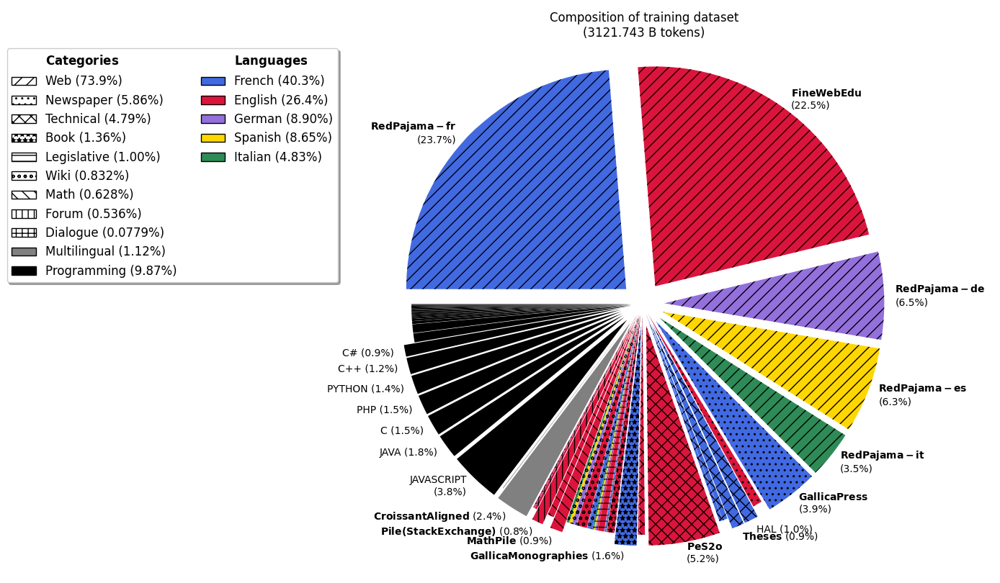

# Model Card for Lucie-7B

<!-- inspired from the following template:
https://github.com/huggingface/huggingface_hub/blob/main/src/huggingface_hub/templates/modelcard_template.md?plain=1
-->

* [Model Description](#model-description)
<!-- * [Uses](#uses) -->
* [Example code in python](#example-code-in-python)
  * [Sentence completion](#sentence-completion)
  * [Load a checkpoint](#load-a-checkpoint)
* [Training Details](#training-details)
  * [Training Data](#training-data)
  * [Training Procedure](#training-procedure)
<!-- * [Evaluation](#evaluation) -->
* [Acknowledgements](#acknowledgements)
* [Contact](#contact)

## Model Description

Lucie-7B is a pretrained 7B parameter causal language model built by [LINAGORA](https://labs.linagora.com/) and [OpenLLM-France](https://github.com/OpenLLM-France),
available under the [Apache 2.0 license](https://www.apache.org/licenses/LICENSE-2.0).

Lucie-7B was trained on 3 trillion tokens of multilingual data, including
English (33.2%),
French (32.4%),
German (6.9%),
Spanish (6.6%),
Italian (3.8%),
and parallel data from those languages (2.5%),
as well as several programming languages (14.7%).

## Example code in python

### Sentence completion

Load the model (quantized version on GPU if possible, for efficient inference):
```python
import transformers

model_name = "OpenLLM-France/Lucie-7B"

tokenizer = transformers.AutoTokenizer.from_pretrained(model_name)
model = transformers.AutoModelForCausalLM.from_pretrained(model_name,
    device_map="auto",
    load_in_4bit=True       # For efficient inference, if quantization is supported by the GPU card
)
```

Wrap the model in a text generation pipeline, and prepare some generation parameters:
```
pipeline = transformers.pipeline("text-generation", model=model, tokenizer=tokenizer)

generation_kwargs = dict(
    num_return_sequences=1,               # Number of variants to generate.
    return_full_text= False,              # Do not include the prompt in the generated text.
    do_sample=True,
    temperature=1.0, top_p=1, top_k=None, # Sampling parameters.
    max_new_tokens=200,                   # Maximum length for the output text (in number of tokens).
)
```

Try 1-shot question answering:
```python
prompt = """\
Quelle est la capitale de l'Espagne ? Madrid\n\
Quelle est la capitale de la France ?\
"""
completions = pipeline(prompt, **generation_kwargs)
for completion in completions:
    print(prompt + " […]" + completion['generated_text'])
```
This will print something like:
```
Quelle est la capitale de l'Espagne ? Madrid
Quelle est la capitale de la France ? […] Paris
Quelle est la capitale de l'Italie? Rome
Quelle est la capitale de la Grande-Bretagne? Londres
Quelle est la capitale de la Suisse? Berne
Quelle est la capitale du Portugal? Lisbonne
Quelle est la capitale de l'Algérie? Alger
...
```

If running on GPU (`cuda` device), you will need at least 6GB of VRAM to run inference using 4bit quantization (16GB of VRAM without 4bit quantization).

### Load a checkpoint

Checkpoints at several training steps are available under revision tags,
every 5000 steps during the first 25000 steps, and then every 25000 steps.

Intermediate checkpoints can be loaded using the `revision` parameter:
```python
model = transformers.AutoModelForCausalLM.from_pretrained(model_name,
    revision="step0400000",
    ...
)
```
where `revision` can be one of:
* ["`step0005000`"](https://huggingface.co/OpenLLM-France/Lucie-7B/tree/step0005000), ["`step0010000`"](https://huggingface.co/OpenLLM-France/Lucie-7B/tree/step0010000), ["`step0015000`"](https://huggingface.co/OpenLLM-France/Lucie-7B/tree/step0015000), ["`step0020000`"](https://huggingface.co/OpenLLM-France/Lucie-7B/tree/step0020000): each 5000 steps for the first pre-training steps.
* ["`step0025000`"](https://huggingface.co/OpenLLM-France/Lucie-7B/tree/step0025000), ["`step0050000`"](https://huggingface.co/OpenLLM-France/Lucie-7B/tree/step0050000), ["`step0075000`"](https://huggingface.co/OpenLLM-France/Lucie-7B/tree/step0075000), ["`step0100000`"](https://huggingface.co/OpenLLM-France/Lucie-7B/tree/step0100000), ..., ["`step0750000`"](https://huggingface.co/OpenLLM-France/Lucie-7B/tree/step0750000): each 25000 steps from 25k to 750k steps.
* ["`step0753851`"](https://huggingface.co/OpenLLM-France/Lucie-7B/tree/step0753851): last pre-training step before context extension and annealing.

## Training Details

### Training Data

The training dataset used for the pretraining of Lucie-7B is available
at [OpenLLM-France/Lucie-Training-Dataset](https://huggingface.co/datasets/OpenLLM-France/Lucie-Training-Dataset).
<!-- and described in ["The Lucie Training Dataset" (2024/12)](https://arxiv.org/abs/xxxx.xxxxx). -->

The initial composition of the training data is as follows:


Some of the data was upsampled to balance the training data distribution, and the final composition is as follows:



### Training Procedure 

Lucie-7B is a causal decoder-only model trained on a causal language modeling task (i.e., predict the next token).

It was pre-trained on 512 H100 80GB GPUs for about 550\,000 GPU hours on [Jean Zay supercomputer](http://www.idris.fr/eng/jean-zay/jean-zay-presentation-eng.html).

The training code is available at [https://github.com/OpenLLM-France/Lucie-Training](https://github.com/OpenLLM-France/Lucie-Training).
It is based on [this fork of Megatron-DeepSpeed](https://github.com/OpenLLM-France/Megatron-DeepSpeed).

Optimizer checkpoints are available at [OpenLLM-France/Lucie-7B-optimizer-states](https://huggingface.co/OpenLLM-France/Lucie-7B-optimizer-states).

#### Neural Network Architecture

Lucie-7B has the same neural network architecture as Llama3.
It has exactly 6 706 958 336 free parameters,
with the following hyperparameters:
| **Hyperparameter**        | **Value** |
|---------------------------|---------|
| Vocabulary size (\# tokens)| 65 024|
| ROPE theta                | 500 000|
| \# transformer blocks     |      32|
| \# attention heads        |      32|
| \# key-value heads        |       8|
| Hidden size               |   4 096|
| Feed-Forward hidden size  |  12 288|
| Activation                |  `silu`|
| RMS norm epsilon          |    1e-5|

#### Training Hyperparameters

Training hyperparameters in torch/Megatron-DeepSpeed were the following:
| **Hyperparameter**     | **Value**  |
|------------------------|------------|
| Optimizer              | `AdamW`    |
| Precision              | `bfloat16` |
| Initial batch size     | 256        |
| Final batch size       | 1024       |
| Batch size rampup      | by steps of 64 over 10M samples |
| Context length         | 4096       |
| Learning rate schedule | warmup (2M samples) + cosine annealing |
| Maximum Learning rate  | 3e-4       |
| Final Learning rate    | 3e-5       |
| Weight decay           | 0.1        |
| Dropout                | _          |
| Gradient clipping      | 1          |
| Initializer range      | 0.009        |
| Tensor Parallelism (with 512 GPUs)   | 4           |
| Pipeline Parallelism (with 512 GPUs) | 4           |
| Data Parallelism (with 512 GPUs)     | 32          |


## Acknowledgements

This work was performed using HPC resources from GENCI–IDRIS (Grant 2024-GC011015444).

Lucie-7B was created by members of [LINAGORA](https://labs.linagora.com/) and OpenLLM-France community, including in alphabetical order:
Christophe Cerisara (LORIA),
Evan Dufraisse (CEA),
Julie Hunter (LINAGORA),
Jean-Pierre Lorré (LINAGORA),
Jérôme Louradour (LINAGORA),
Michel-Marie Maudet (LINAGORA),
Olivier Gouvert (LINAGORA),
Pierre-Carl Langlais (OpSci),
Yaya Sy (LORIA).

## Contact

contact@openllm-france.fr
