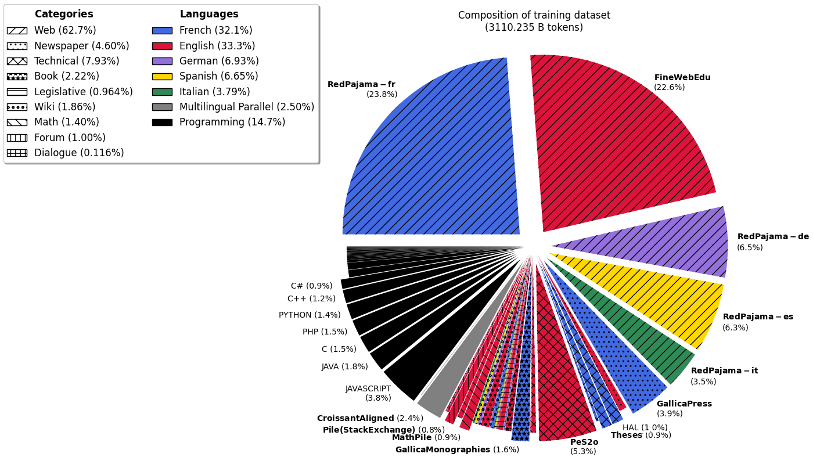

# Model Card for Lucie-7B

<!-- inspired from the following template:
https://github.com/huggingface/huggingface_hub/blob/main/src/huggingface_hub/templates/modelcard_template.md?plain=1
-->

* [Model Description](#model-description)
<!-- * [Uses](#uses) -->
* [Example Code in Python](#example-code-in-python)
  * [Load the model](#load-the-model)
  * [Sentence completion](#sentence-completion)
  * [Load a checkpoint](#load-a-checkpoint)
* [Training Details](#training-details)
  * [Training Data](#training-data)
  * [Training Procedure](#training-procedure)
    * [Neural Network Architecture](#neural-network-architecture)
    * [Training Hyperparameters](#training-hyperparameters)
      1. [Main Pre-training](#1-main-pre-training)
      2. [Context Extension](#2-context-extension)
      3. [Annealing](#3-annealing)
  * [Training Logs and Learning Curves](#training-logs-and-learning-curves)
<!-- * [Evaluation](#evaluation) -->
* [Disclaimer](#disclaimer)
* [Citation](#citation)
* [Acknowledgements](#acknowledgements)
* [Contact](#contact)

## Model Description

Lucie-7B is a pretrained 7B parameter causal language model built by [LINAGORA](https://labs.linagora.com/) and [OpenLLM-France](https://github.com/OpenLLM-France),
available under the [Apache 2.0 license](https://www.apache.org/licenses/LICENSE-2.0).

Lucie-7B was trained on 3 trillion tokens of multilingual data, including
English (33.2%),
French (32.4%),
German (6.9%),
Spanish (6.6%),
Italian (3.8%),
and parallel data from those languages (2.5%),
as well as several programming languages (14.7%).

## Example Code in Python

### Load the model

Load the model (quantized version on GPU if possible, for efficient inference):
```python
import transformers

model_name = "OpenLLM-France/Lucie-7B"

tokenizer = transformers.AutoTokenizer.from_pretrained(model_name)
model = transformers.AutoModelForCausalLM.from_pretrained(model_name,
    device_map="auto",
    load_in_4bit=True       # For efficient inference, if quantization is supported by the GPU card
)
```
### Sentence completion

Wrap the model in a text generation pipeline, and specify some generation parameters:
```
pipeline = transformers.pipeline("text-generation", model=model, tokenizer=tokenizer)

generation_kwargs = dict(
    num_return_sequences=1,               # Number of variants to generate.
    return_full_text= False,              # Do not include the prompt in the generated text.
    do_sample=True,
    temperature=1.0, top_p=1, top_k=None, # Sampling parameters.
    max_new_tokens=200,                   # Maximum length for the output text (in number of tokens).
)
```

Try 1-shot question answering:
```python
prompt = """\
Quelle est la capitale de l'Espagne ? Madrid\n\
Quelle est la capitale de la France ?\
"""
completions = pipeline(prompt, **generation_kwargs)
for completion in completions:
    print(prompt + " […]" + completion['generated_text'])
```
This will print something like:
```
Quelle est la capitale de l'Espagne ? Madrid
Quelle est la capitale de la France ? […] Paris
Quelle est la capitale de l'Italie? Rome
Quelle est la capitale de la Grande-Bretagne? Londres
Quelle est la capitale de la Suisse? Berne
Quelle est la capitale du Portugal? Lisbonne
Quelle est la capitale de l'Algérie? Alger
...
```

If running on GPU (`cuda` device), you will need at least 6GB of VRAM to run inference using 4bit quantization (16GB of VRAM without 4bit quantization).

### Load a checkpoint

Checkpoints at several training steps are available under revision tags,
every 5000 steps during the first 25000 steps, and then every 25000 steps.

Intermediate checkpoints can be loaded using the `revision` parameter:
```python
model = transformers.AutoModelForCausalLM.from_pretrained(model_name,
    revision="step0753851",
    ...
)
```
where `revision` can be one of:
* "[`step0005000`](https://huggingface.co/OpenLLM-France/Lucie-7B/tree/step0005000)", "[`step0010000`](https://huggingface.co/OpenLLM-France/Lucie-7B/tree/step0010000)", "[`step0015000`](https://huggingface.co/OpenLLM-France/Lucie-7B/tree/step0015000)", "[`step0020000`](https://huggingface.co/OpenLLM-France/Lucie-7B/tree/step0020000)": every 5000 steps for the first pre-training steps (with a context length of 4096).
* "[`step0025000`](https://huggingface.co/OpenLLM-France/Lucie-7B/tree/step0025000)", "[`step0050000`](https://huggingface.co/OpenLLM-France/Lucie-7B/tree/step0050000)", "[`step0075000`](https://huggingface.co/OpenLLM-France/Lucie-7B/tree/step0075000)", "[`step0100000`](https://huggingface.co/OpenLLM-France/Lucie-7B/tree/step0100000)", ..., "[`step0750000`](https://huggingface.co/OpenLLM-France/Lucie-7B/tree/step0750000)": every 25000 steps from 25k to 750k steps.
* "[`step0753851`](https://huggingface.co/OpenLLM-France/Lucie-7B/tree/step0753851)": last pre-training step before context extension and annealing.
* "[`extension_step0000250`](https://huggingface.co/OpenLLM-France/Lucie-7B/tree/extension_step0000250)", "[`extension_step0000500`](https://huggingface.co/OpenLLM-France/Lucie-7B/tree/extension_step0000500)", "[`extension_step0000750`](https://huggingface.co/OpenLLM-France/Lucie-7B/tree/extension_step0000750)", "[`extension_step0001000`](https://huggingface.co/OpenLLM-France/Lucie-7B/tree/extension_step0001000)", "[`extension_step0001220`](https://huggingface.co/OpenLLM-France/Lucie-7B/tree/extension_step0001220)": several checkpoints during context extension (with a context length of 32000).

## Training Details

### Training Data

The training dataset used for the pretraining of Lucie-7B is available
at [OpenLLM-France/Lucie-Training-Dataset](https://huggingface.co/datasets/OpenLLM-France/Lucie-Training-Dataset).
<!-- and described in ["The Lucie Training Dataset" (2024/12)](https://arxiv.org/abs/xxxx.xxxxx). -->

The initial composition of the training data is as follows:


Some of the data was upsampled to balance the training data distribution yielding the following  composition for training:



### Training Procedure 

Lucie-7B is a causal decoder-only model trained on a causal language modeling task (i.e., predict the next token).

It was pre-trained on 512 H100 80GB GPUs for about 550\,000 GPU hours on the [Jean Zay supercomputer](http://www.idris.fr/eng/jean-zay/jean-zay-presentation-eng.html).

The training code is available at [https://github.com/OpenLLM-France/Lucie-Training](https://github.com/OpenLLM-France/Lucie-Training).
It is based on [this fork of Megatron-DeepSpeed](https://github.com/OpenLLM-France/Megatron-DeepSpeed).

Optimizer checkpoints are available at [OpenLLM-France/Lucie-7B-optimizer-states](https://huggingface.co/OpenLLM-France/Lucie-7B-optimizer-states).

#### Neural Network Architecture

Lucie-7B has the same neural network architecture as [Llama3.1](https://huggingface.co/meta-llama/Llama-3.1-8B).
It has exactly 6 706 958 336 free parameters,
with the following hyperparameters:
| **Hyperparameter**        | **Value** |
|---------------------------|---------|
| Vocabulary size (\# tokens)| 65 024 |
| \# transformer blocks     |      32 |
| \# attention heads        |      32 |
| \# key-value heads        |       8 |
| Hidden size               |   4 096 |
| Feed-Forward hidden size  |  12 288 |
| Activation                |  `silu` |
| RMS norm epsilon          |    1e-5 |

The "theta" parameter of Rotary Positional Embedding (RoPE) was increased during the training process. Its values are indicated in the tables with training hyperparameters below.

#### Training Hyperparameters

The training consisted of three main phases:
1. Main pre-training on 3.1T tokens, with a context length of 4096,
2. Context extension on 5B tokens, with a context length of 32000,
3. Annealing on 5B tokens of high quality data composed of a mixture of new data and data seen during training.
<!-- perhaps cite the dataset for annealing  -->

The details of each phase are given below.

##### 1. Main Pre-training

Training hyperparameters in torch/Megatron-DeepSpeed were as follows:
| **Hyperparameter**     | **Value**  |
|------------------------|------------|
| Total \# samples| 762 144 586 (3.1T tokens) |
| Total \# steps  | 753 851    |
| RoPE theta             | 500 000    |
| Context length         | 4 096      |
| Initial Batch size     | 256        |
| Final Batch size       | 1 024      |
| Batch size rampup      | by steps of 64 over 10M samples |
| Learning rate schedule | warmup (2M samples) + cosine annealing |
| Maximum Learning rate  | 3e-4       |
| Final Learning rate    | 3e-5       |
| Weight decay           | 0.1        |
| Dropout                | _          |
| Gradient clipping      | 1          |
| Initializer range      | 0.009        |
| Optimizer              | `AdamW` (β₁=0.9, β₂=0.95, ε=1e-5)    |
| Precision              | `bfloat16` |
| Tensor Parallelism (with 512 GPUs)   | 4           |
| Pipeline Parallelism (with 512 GPUs) | 4           |
| Data Parallelism (with 512 GPUs)     | 32          |

#### 2. Context Extension

Training hyperparameters are the same as above, with the following changes:
| **Hyperparameter**     | **Value**  |
|------------------------|------------|
| Total \# samples| 156 250 (5B tokens) |
| Total \# steps  | 1 220      |
| RoPE theta             | 20 000 000 |
| Context length         | 32 000     |
| Batch size             | 128        |
| Learning rate          | 2e-5       |
| Learning rate schedule | constant   |
| Tensor Parallelism (with 128 GPUs)   | 4     |
| Pipeline Parallelism (with 128 GPUs) | 4     |
| Data Parallelism (with 128 GPUs)     | 8     |

#### 3. Annealing

Training hyperparameters are the same as for context extension, with the following changes:
| **Hyperparameter**     | **Value**  |
|------------------------|------------|
| Learning rate schedule | linear annealing |
| Maximum Learning rate  | 3e-5       |
| Final Learning rate    | 0          |

### Training Logs and Learning Curves

#### Training loss

Training logs can be found in Tensorboard format in:
* [`metadata/training_logs/`](https://huggingface.co/OpenLLM-France/Lucie-7B/tree/main/metadata/training_logs)
<br> ├── [`1_pretraining.zip`](metadata/training_logs/1_pretraining.zip) training logs for the first pre-training phases,
in a zip file. Each file in the zip corresponds to a job of at most 20H of training (parallelized over 512 GPUs).
<br> ├── [`2_extension/`](https://huggingface.co/OpenLLM-France/Lucie-7B/tree/main/metadata/training_logs/2_extension) folder containing the training log <br> └── [`3_annealing/`](https://huggingface.co/OpenLLM-France/Lucie-7B/tree/main/metadata/training_logs/3_annealing) folder containing the training log for the annealing phase, which also took around 13H of training (parallelized over 128 GPUs).

The convergence curves of the three pre-training phases are the following:


Data corresponding to these plots were extracted from tensorboard logs and are available in the following CSV files:
* [`metadata/training_logs/`](https://huggingface.co/OpenLLM-France/Lucie-7B/tree/main/metadata/training_logs)
<br> ├── [`1_pretraining.csv`](metadata/training_logs/1_pretraining.csv)
<br> ├── [`2_extension.csv`](metadata/training_logs/2_extension.csv)
<br> └── [`3_annealing.csv`](metadata/training_logs/3_annealing.csv)

#### Evaluations

Multiple evaluations were conducted during Lucie-7B's training to assess its performance on standard benchmarks,
primarily in French and English, as well as in Spanish, German, and Italian.

Evaluation results on benchmark datasets of checkpoints of Lucie-7B throughout the training process are available at
[metadata/evaluation_learning_curve_lucie.csv](metadata/evaluation_learning_curve_lucie.csv).
Evaluation results of baseline models on the same benchmark datasets are available at
[metadata/evaluation_baselines.csv](metadata/evaluation_baselines.csv).

Main results are summarized in the following figures:

### French


### English


### other


### Needle in a Haystack

#### Pretraining
 

#### Context Extension
 

#### Annealing
 


## Disclaimer

Lucie-7B is a language model trained solely to predict the most probable next word in a sequence. Despite efforts to filter the [Lucie Training Dataset](https://huggingface.co/datasets/OpenLLM-France/Lucie-Training-Dataset), it is possible that Lucie-7B encountered strings containing toxic or offensive language during its training and as a result, it may generate strings of similar quality. To limit such behavior, it is advised to fine-tune Lucie-7B through instruction and/or preference tuning (DPO, RLHF, etc.).

## Citation

TODO


## Acknowledgements

This work was performed using HPC resources from GENCI–IDRIS (Grant 2024-GC011015444).

Lucie-7B was created by members of [LINAGORA](https://labs.linagora.com/) and the [OpenLLM-France](https://www.openllm-france.fr/) community, including in alphabetical order:
Agustin Martin Picard (IRT),
Thibaut Boissin (IRT),
Christophe Cerisara (LORIA),
Evan Dufraisse (CEA),
Julie Hunter (LINAGORA),
Jean-Pierre Lorré (LINAGORA),
Jérôme Louradour (LINAGORA),
Lucas Hervier (IRT),
Michel-Marie Maudet (LINAGORA),
Olivier Gouvert (LINAGORA), and
Yaya Sy (LORIA).

We thank 
Anastasia Stasenko (OpSci/Pleias), 
Clément Bénesse (Opsci), 
Guokan Shang (MBZUAI), 
Ismaïl Harrando (LINAGORA), 
Joël Gombin (Opsci), 
Jordan Ricker (Opsci), 
Olivier Ferret (CEA), 
Pierre-Carl Langlais (OpSci/Pleias), 
and 
Rachel Bawden (INRIA),
for their helpful input.

## Contact

contact@openllm-france.fr
