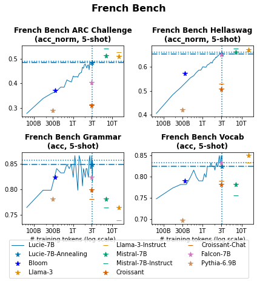
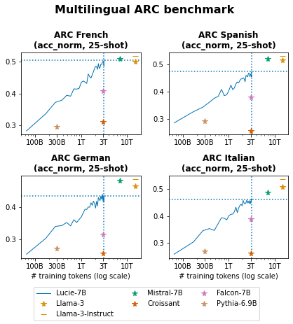

# Lucie-7B Pretraining Chronicles

This folder contains materials collected during the pretraining of the [Lucie-7B LLM](https://huggingface.co/OpenLLM-France/Lucie-7B).

Included are logs and evaluation results that provide insights into the amounts and types of data used for training,
as well as the model's performance convergence.

# Convergence and Learning Curves

## Training loss

Training logs collected with Tensorboard during the pretraining of Lucie-7B are available
in [`*/training_logs.csv`](1_pretraining/training_logs.csv) CSV files.

The training losses are shown in the following figure, for the 3 stages of the pretraining:

## Evaluation Benchmarks

Multiple evaluations were conducted during Lucie-7B's training to assess its performance on standard benchmarks,
primarily in French and English, as well as in Spanish, German, and Italian.

Raw results can be found in CSV tables:
* [`evaluation_learning_curve_lucie.csv`](evaluation_learning_curve_lucie.csv) contains all results on checkpoints collected during the training of Lucie-7B.
   (*note:* all checkpoints are available in revisions of the [Lucie-7B model repository](https://huggingface.co/OpenLLM-France/Lucie-7B#load-a-checkpoint))
* [`evaluation_baselines.csv`](evaluation_baselines.csv) contains the results of some baseline models on the same datasets.

The sub-folder [`figs/`](figs) contains corresponding learning curves shown below.

### French

### English

### other

