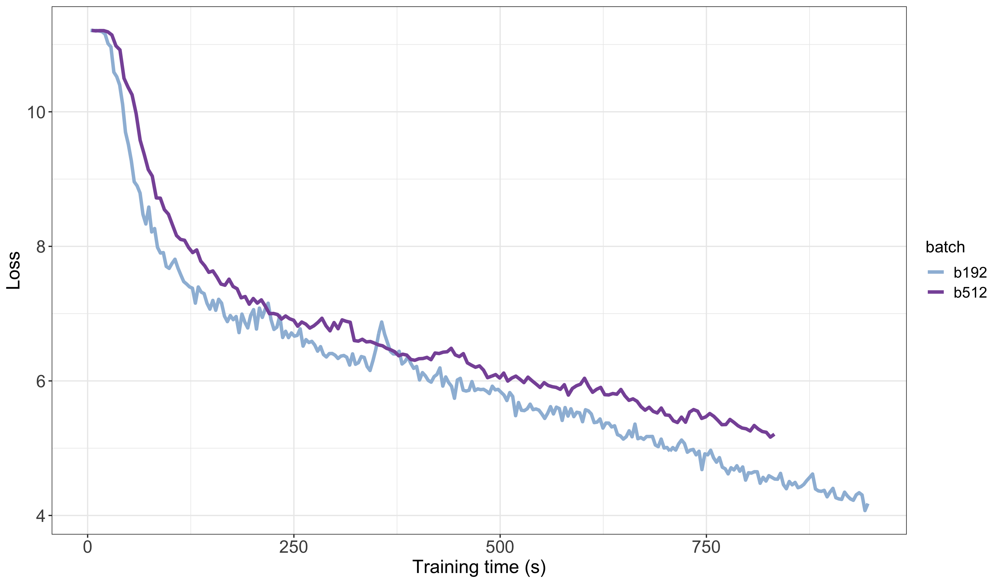

# Loss Curves as a Function of Batch Sizes for 2048 context length

For ~20min of training, we illustrate this with the [best](parallelism.md#comparisons-for-different-parallelism-strategies-for-2048-context-length) parallelism strategy for 2048 context length found in: `TP=2,PP=2`.

## Loss ~ Tokens

Loss as a function of seen tokens for batch sizes of 192 and 512.

## Loss ~ Training Time

Loss as a function of training time, with `training_time_in_seconds = consumed_tokens / ntokens_per_second`

