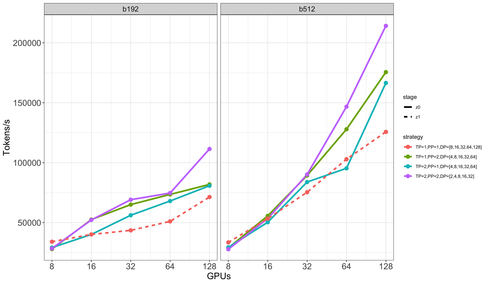

# Search for the Best Parallelism Option on Jean-Zay

Each experiment experiment is runed for ~20min, and we collected the statistics from Megatron logs. One line of log looks like:

`[default7]: iteration 2/ 250000 | consumed samples: 384 | consumed tokens: 786432 | elapsed time per iteration (ms): 5350.0 | learning rate: 3.000E-07 | global batch size: 192 | lm loss: 1.119602E+01 | grad norm: 18.118 | num zeros: 0.0 | actual seq length: 2048 | number of skipped iterations: 0 | number of nan iterations: 0 | samples per second: 35.888 | TFLOPs: 48.77 |`

Here, the number of tokens per second is `samples per second * actual seq length = 35.888 * 2048 = 73 498,644`

## Stages Options

- `z0`: The optimizer state is not sharded across GPUs but is replicated identically on each GPU. So each GPU has the entire optimizer state, which takes up a huge proportion of the GPU memory.
- `z1`: The optimizer state is sharded across GPUs, which frees up memory on a GPU to increase the batch size, model size, perform data parallelism, etc.

## Parallelism Options

We use 3D parallelism, with `TP=Tensor Parallelism, PP=Pipeline Parallelism, DP=Data Parallelism`. The `DP` is automatically infered from the two other values: `DP= nGPUs / (TP * PP)`

- `TP=1, PP=1`: This is full DP, meaning the model is not partitioned across multiple GPUs. Only `z1` is possible as it frees up memory on GPUs so the model can train on a single GPU.
- `TP=1, PP=2`: This means the layers are shared in two, and each GPU has a copy of one of the layers.
- `TP=2, PP=1`: This means the matrices/modules are shared in two, and each GPU has a copy of one part of the matrices/modules.
- `TP=2, PP=2`: This means that the different layers are divided into two segments. Within each layer segment, the matrices/modules are further divided into two parts. Therefore, each GPU has a copy of one part of a matrix/module, originating from one of the layer segments.

## Global Batch Size Options:
The micro batch size depends on the parallelization strategy as some strategies are more memory-intensive than others, and therefore we can set a large micro-batch size for some and not for others. In general, we tested the maximum Micro Batch Size (MBS) that does not cause OOM and respects the rule of divisibility: `GBS % (MBS * nGPUs / TT / TP) == 0`.

| nGPUs   | TP=1, PP=1 |        | TP=2, PP=1 |        | TP=1, PP=2 |        | TP=2, PP=2 |        |
|---------|------------|--------|------------|--------|------------|--------|------------|--------|
|         | GBS        | MBS    | GBS        | MBS    | GBS        | MBS    | GBS        | MBS    |
| 8 GPUs  | 512        | 2      | 512        | 4      | 512        | 2      | 512        | 4      |
|         | 192        | 3      | 192        | 4      | 192        | 2      | 192        | 6      |
| 16 GPUs | 512        | 2      | 512        | 4      | 512        | 4      | 512        | 4      |
|         | 192        | 3      | 192        | 4      | 192        | 4      | 192        | 6      |
| 32 GPUs | 512        | 2      | 512        | 4      | 512        | 4      | 512        | 4      |
|         | 192        | 3      | 192        | 4      | 192        | 4      | 192        | 6      |
| 64 GPUs | 512        | 2      | 512        | 4      | 512        | 4      | 512        | 4      |
|         | 192        | 3      | 192        | 4      | 192        | 4      | 192        | 6      |
| 128 GPUs| 512        | 2      | 512        | 4      | 512        | 4      | 512        | 4      |
|         | 256        | 2      | 192        | 3      | 192        | 4      | 192        | 6      |

\* __NOTE:__ As mentioned in the table, `TP=1,PP=1` (full Data Parallelism) uses a Global Batch Size (GBS) of 256 instead of 192